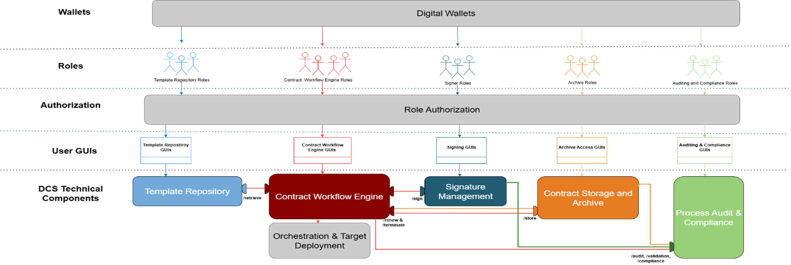
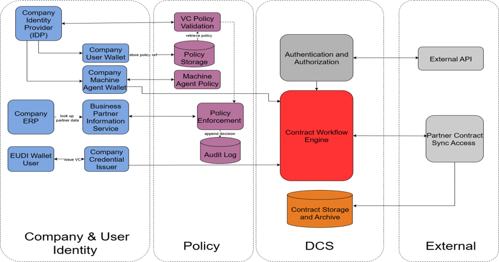
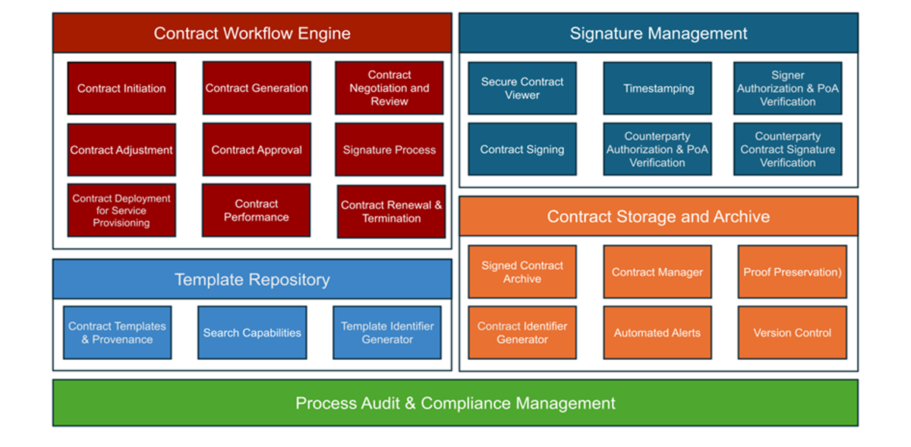
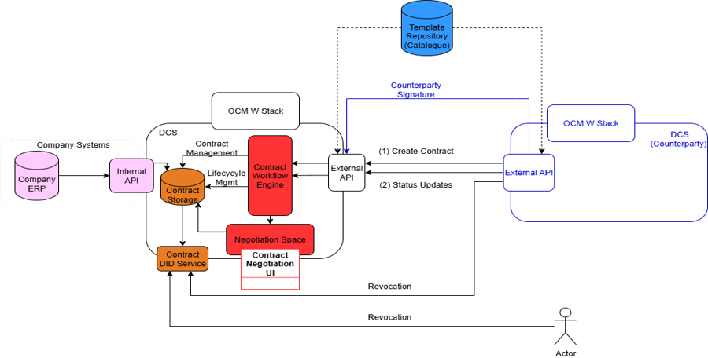

[← Introduction](01_introduction.md) · [↑ Table of Contents](../README.md) · [Requirements →](03_requirements.md)

---

## 2 Product Overview

### 2.1 Product Perspective

<em>Fig.1 – Simplified Digital Contracting Service diagram</em>

FACIS project defines a governance framework and a set of Federation Architecture Patterns (FAPs) that bundle multi-provider Cloud-Edge capabilities into interoperable service clusters with agreed Service-Level Agreements. All artifacts are released as Free and Open-Source Software to speed adoption and ensure crossdomain interoperability. DCS is a modular and standards-aligned software platform developed within the governance framework of FACIS. Its purpose is to enable the secure, verifiable, and automated lifecycle management of digital contracts, with a strong focus on business-to-business (B2B) use cases. It supports structured SLAs as the primary contract type and operates with machine-readable document formats that can be rendered into human readable formats. DCS enables workflows such as contract creation and negotiation, verifiable signing with identity and PoA credentials, SLA monitoring and performance tracking, deployment of machine-readable contracts to external systems, and secure storage, audit logging, and compliance reporting. These scenarios reflect the core product perspective of DCS. The product reuses and builds upon open standards such as W3C Verifiable Credentials (VCs), JSON-LD, SHACL, PAdES/JAdES, and

UUID/DID identifier schemes, and the system has the capability to interface with external systems via RESTful APIs.

DCS encompasses a set of functional components that work together to provide end-to-end digital contract handling. These include a template repository for managing contract templates in machine-readable and human-readable formats; a contract workflow engine that drives lifecycle automation and ensures consistency across representations; a signature management module that ensures legally valid and verifiable electronic signatures with support for role-based signing; a contract storage and archival system that guarantees secure retention of signed agreements; and a compliance and audit module that maintains tamper-proof records and supports regulatory reporting. Fig. 1 illustrates the major DCS components marked with colors. The user roles categorized for each technical component in Fig.1 are defined in Section 2.4. Furthermore, DCS integrates and interfaces with the XFSC components, which are listed as follows:

- XFSC Catalogue: Template repository features defined in DCS are aligned with XFSC Catalogue functionalities and discovering and requesting templates via the Catalogue MUST be made available. The link to the XFSC Catalogue Architecture document is provided in Appendix F.
- XFSC’s OCM W-Stack as the digital wallet for organizations. OCM W-Stack provides OpenID for Verifiable Credential Issuance (OpenID4VCI) functionalities and is provided as an example in Appendix D.
- A digital wallet for natural persons supporting OpenID for Verifiable Credential Issuance (OpenID4VCI) and OpenID for Verifiable Presentations (OpenID4VP) as profiled by the Architecture and Reference Framework (ARF). The selection of a specific wallet implementation is out of scope; any chosen wallet MUST demonstrate ARF compliance.
- XFSC Orchestration Engine: Contract Workflow Engine features defined in DCS are aligned with XFSC Orchestration Engine. The deployment of the XFSC Orchestration Engine is not required as the engine can be hosted by ECO. Since XFSC Orchestration Engine is based on Node-RED, all DCS components MUST expose Node-RED–compatible interfaces to enable workflow execution via the orchestration engine. XFSC orchestration documentation is provided as an Appendix to the specification and training will be provided by ECO for orchestration engine when requested.
- Revocation List: The contractors are advised to use XFSC-compatible solutions for the revocation features of digital wallets. XFSC’s Status List Service is part of OCM W-Stack, and can be used stand alone for creating status lists for revocation. An example is provided in Appendix D and E.
- SD-JWT: XFSC’s SD-JWT service is a micro service for creating SD-JWTs. It is also used by the TSA signing/verification over the Crypto Provider Service, but it can be used as standalone service as well
- Authentication and Authorization Service for user roles: This service is required to log in users with authorization flows for the given roles based on credentials stored in digital wallets. Ory/Hydra is an open-source OAuth2 and OpenID Connect (OIDC) server and is recommended as a solution used for authorization flows and role authentication with digital wallets. However, use of Ory/Hydra is optional.

In addition to this representation, the Reference Architecture of the Digital Contracting Service is shown in Fig. 2. This figure depicts the main components together with their interfaces. Detailed descriptions of the components and their interfaces are provided in the subsequent section.

<em>Fig.2 – DCS reference architecture and main flows</em>

### 2.2 Product Functions

As mentioned in Section 2.1, DCS consists of five key functional components. The functions required in each component are given in Fig. 3 and are listed in this section. In addition, the DCS-to-DCS communication pattern is illustrated in Fig. 4 as a separate product function, showing how two DCS instances exchange contracts, state updates, and revocations across organizational boundaries.

<em>Fig.3 – Conceptual technical components of Digital Contracting Service</em>

#### 2.2.1 Template Repository

Template Repository (TR) facilitates the storage and management of contract templates in machine readable source forms. Below are the key functions of template repository:

- Contract Templates & Provenance: Repository stores contract templates in machine readable source forms, with the capability of converting them to human-readable formats when requested. The templates are designed to ensure standardized usage in the service. Template provenance means tracking who or which system role uploaded or modified a template to maintain regulatory alignment. The repository MUST maintain provenance tracking for all contract templates, recording their creation, modifications, approvals, and historical versions. All tracking data MAY be logged into an external system.
- Search Capabilities: Includes advanced search features that allow users to efficiently locate templates based on metadata, categories, or specific keywords. Repositories can also support clausespecific searches within internal templates, enhancing precision and usability.
- Template Identifier Generator: A generator that assigns globally UUIDs or DIDs to templates, ensuring they are universally identifiable and traceable across contract workflows.

The interfaces required for the Template Repository can be listed as follows:

- TR → CWE: The Template Repository exposes retrieval and verification endpoints so the Workflow Engine can select an approved template and verify its integrity before contract creation.
- TR ↔ PACM: Every template action (create, modify, approve, delete) emits an auditable event to Process Audit & Compliance Management.
- TR → Users (REST/UI): The repository provides CRUD, search, verify, and approval endpoints and UIs for managers/reviewers to manage templates under Role-Based Access Control (RBAC). The list of user interfaces and their requirements are given in Section 3.1.1.

XFSC Federated Catalogue (CAT) SHOULD be used as the component to build these functionalities for the template repository, and to adhere to the functional requirements listed in Section 3.2. CAT will first be used

to implement a Minimum Viable Product (MVP) template repository with limited incremental changes. This version contains the following features: Templates are stored in machine-readable form within an RDF/SHACL-centric model. Validation occurs at ingestion, which includes syntactic RDF/JSON-LD parsing and semantic integrity to registered identifiers. In addition, references to human-readable renderings are maintained. Metadata and full-text indexing support search and retrieval. An identifier mechanism issues UUIDs or DIDs for templates and versions. RBAC governs access to objects and lifecycle operations. Provenance is recorded for creation, modification, approval and publication events and may be written to an external audit facility. Collectively, these capabilities allow the repository to store, search, retrieve, verify, version and govern templates with fine-grained access control.

Planned platform extensions focus on interoperability and governance. The repository SHOULD maintain durable links between machine-readable sources and human-authored artefacts, with cryptographic checksums for integrity. A dependency model SHOULD capture includes/extends/requires relations among templates and schemas. A unified export SHOULD package versioned templates together with dependencies and artefacts for consumption by external systems. Workflow support SHOULD cover multi-party review and approval with defined states, assignments and comments, exposed through administrative and steward user interfaces that provide search, diff and lifecycle controls. Provenance SHOULD be expanded into a graph that relates contributors, approvals, artefact hashes and upstream dependencies. An optional subscription mechanism may notify consumers of relevant changes, including impact analysis across dependency trees where feasible. Where non-RDF structures (e.g. JSON Schema) are required, adapters SHOULD permit sideby-side storage while preserving CAT as the canonical source.

#### 2.2.2 Contract Workflow Engine

Contract Workflow Engine automates the contract lifecycle, from initiation to execution. It is responsible for managing the contract lifecycle according to best practices. It provides a set of features required for seamless digital contracting. The functions of the workflow are given below:

- Contract Initiation: This feature allows participants to initiate the contract creation process by submitting a contract request. The party that submitted the request is the Initiator and the party that received the request is the Responder in bilateral contracts. Multilateral contracts have one Initiator, but they can have multiple Responders. The Initiator is then allowed to select an appropriate matching template of the machine-readable source reference which is converted to an identical human-readable contract format. The source reference and the human-readable result MUST be linked to each other with the same Template UUID, and after this point in the workflow, all changes MUST occur identically in both formats.
- Contract Generation: This feature dynamically populates the selected contract templates with the metadata provided by the Initiator during the contract initiation phase and then fills in the necessary placeholders in the contract template. At the end of this step, the filled-out contract MUST be ready to be sent to the Responder or Responders to start the next phase in the workflow.
- Contract Negotiation and Review: This workflow starts with the first review of the Responder or Responders to the contract generated by the Initiator. After this review, Responders have the option to accept, negotiate, or refuse the contract. If Responders choose to negotiate the contract request, negotiation phase starts for collaborative editing and review of the contract. Multiple stakeholders can suggest and review changes. It provides version control to track edits and contains review workflows for finalizing contract review phase, sending confirmation to all parties on successful completion. Negotiation includes a dedicated Contract Adjustment sub-workflow for clause-level edits; each accepted adjustment produces a contract version under the same UUID/DID.
- Contract Adjustment: During contract negotiation phase, parties may apply clause-specific, minor updates (add, remove, or modify clauses, terms, or data fields) to the machine-readable source of record. If an adjustment is agreed by both parties, a new version of the contract is created under the same contract ID, and audit logs of this adjustment event are recorded. For each accepted adjustment, the system re-renders the human-readable document to keep both formats aligned.

- Contract Approval: This feature provides a mechanism for stakeholders to approve the finalized contract. It also sends automated notifications and reminders to stakeholders that are part of the approval process.
- Signature Process: After approval, the Signature Process ensures the electronic signing of contracts using the features provided by the Signature Management component of the DCS. It manages the structured workflow and role-based responsibilities to ensure a compliant signing process.
- Contract Deployment for Service Provisioning: After the contract is finalized and signed, this feature ensures the deployment of machine-readable source reference to service endpoints for execution. This approach ensures that service provisioning aligns with the contractual terms and enables automation via APIs.
- Contract Performance: This feature ensures that contractual obligations are monitored, measured, and enforced throughout the contract lifecycle with the support of the Contract Storage and Archive component. Key performance indicators are used to assess whether contractual terms are being met, evaluate contract performance, and optimize future agreements. Additionally, the Automated Alerts feature of the Contract Storage and Archive component sends notifications for contract renewals, expirations, or key deadlines, ensuring that stakeholders remain informed about critical contract events.
- Contract Renewal and Termination: This feature handles both the automated renewal and structured termination of contracts. For renewals, it ensures contracts are renewed based on predefined terms, sending alerts and notifications to stakeholders about upcoming deadlines, leveraging the timestamping feature of the Signature Management component. For terminations, it supports the proper closure of contracts through final reviews and archival in the Contract Storage and Archive component.

The interfaces required for the Contract Workflow Engine (CWE) can be listed as follows:

- CWE ← TR: The Workflow Engine retrieves approved templates and their metadata to assemble and initialize contract instances with synchronized machine- and human-readable forms.
- CWE ↔ SM: After approval, the Workflow Engine invokes Signature Management to run the structured signing process and track signature progress.
- CWE → CSA: When execution completes, the Workflow Engine triggers archival of the finalized contract and evidence in Contract Storage & Archive.
- CWE ↔ PACM: All lifecycle actions (creation, negotiation, approval, state transitions) are logged as immutable audit events for compliance reporting.
- CWE ↔ Policy/Access Controls: Role-based access and policy checks gate workflow actions for creators, reviewers, approvers, and signers.

#### 2.2.3 Signature Management

The Signature Management (SM) component is responsible for ensuring secure, compliant, and verifiable signatures on contracts. This component plays a pivotal role in safeguarding the validity of contracts by adhering to standards such as the European Union’s eIDAS regulations. The following functions define the component:

- Secure Contract Viewer: This feature ensures that contracts can only be accessed in a secure and controlled environment. It prevents unauthorized access and provides a protected interface for reviewing contract details prior to signing.
- Timestamping: This feature facilitates the logging of critical time-bound actions, such as setting deadlines, sending reminders, and recording the exact time of signing.
- Signer Authorization & Power of Attorney (PoA) Credential Chain Verification: This feature validates the authorization of individuals signing the contract, ensuring they have the necessary authority to act on behalf of their organizations. If a PoA exists, the system performs a credential chain verification using a PoA Trust Service to validate the PoA credentials. This ensures that each signature is legally

- binding and represents an authorized party, regardless of whether authorization is direct or via a PoA.
- Contract Signing: This feature manages the actual electronic signing process. It utilizes secure digital signature technologies to ensure that each signature is tamper-evident and legally valid.
- Counterparty Authorization & PoA Credential Chain Verification: This feature ensures that the counterparty involved in the contract has the required authority and authenticity to sign. It verifies the credentials, authenticates the identity, and confirms the proper authorization of the counterparty to act on behalf of their organization. In cases where a PoA exists, a PoA Trust Service is used to perform credential chain verification to validate the PoA credentials. This process guarantees compliance and trust, regardless of the form of authorization.
- Counterparty Contract Signature Verification: This feature verifies the validity of the signature provided by the counterparty, ensuring it is authentic, valid at the time of signing, and complies with regulatory standards. It cross-checks the cryptographic integrity of the digital signature to confirm that the signed document has not been tampered with after signing.

The interfaces required for Signature Management can be listed as follows:

- SM ← CWE: Signature Management receives an approved contract and its envelope from the Workflow Engine to verify content, apply signatures, and validate results.
- SM ↔ Identity/Credential Services: Signer authorization and PoA-credential chain verification are performed against trusted anchors before a signature is accepted.
- SM → CSA: Upon successful signing, the executed contract and all validation artifacts are stored in the archive for long-term retention.
- SM ↔ PACM: Retrieval, verification, signing, validation, revocation, and compliance-check events are appended to the audit trail.
- SM → External Clients (REST/UI): Signature APIs and viewers provide secure retrieval, verify/apply/validate/revoke operations, and compliance reporting to authorized users and systems.

#### 2.2.4 Contract Storage and Archive

The Contract Storage and Archive (CSA) component is deployed for each ecosystem participant, ensuring that their signed contracts are managed, stored, and organized securely. This approach allows each participant to maintain control over their contract management. Its core functions are detailed below:

- Signed Contract Archive: This feature maintains a secure repository for all signed contracts in both machine-readable source forms and their human readable end forms, ensuring they are easily accessible while protecting their confidentiality and integrity.
- Contract Manager: This feature enables users to access and control other features within the Contract Storage and Archive component. It provides an interface for interacting with functionalities such as signed contract retrieval, proof preservation, automated alerts, and version control, enhancing the overall usability of the contract storage system.
- Proof Preservation: This feature ensures the preservation of evidence for legal and compliance purposes, maintaining tamper-evident records of all contracts to protect against disputes and audits.
- Contract Identifier Generator: This feature provides UUIDs or DIDs for contracts, ensuring their traceability and enabling easy reference within the system. The generated contract UUID is separate from the template UUID obtained from the template repository.
- Automated Alerts: This feature sends timely notifications for key events, such as contract renewals, expirations, or deadlines, helping users stay proactive and ensuring compliance with agreed timelines.

The interfaces required for the Contract Storage and Archive can be listed as follows:

- CSA ← SM: The archive automatically ingests executed contracts with signature containers and metadata after the signing workflow completes.
- CSA ↔ CWE/SM: Authorized components can retrieve archived contracts and evidence through search/retrieve APIs and dashboards for further workflow or compliance actions.
- CSA → PACM: Every archival, retrieval, update, and deletion operation produces an immutable audit record with actor, timestamp, operation, and outcome.
- CSA → CWE (Events): Rules-based monitoring generates alerts for expirations, renewals, and deadlines that feed back into workflow tasks.
- CSA → External Clients (REST/UI): Archival, metadata update, tagging, and retrieval functions are exposed via authorized APIs and archive manager UIs.

#### 2.2.5 Process Audit and Compliance Management

Process audit and compliance management service ensures all contract-related activities adhere to legal, regulatory, and organizational standards. This service maintains tamper-proof audit trails for the entire contract lifecycle, capturing all steps in the contract workflow engine. Furthermore, it enables proactive compliance by identifying potential risks, such as unsigned documents or missed deadlines, and issuing alerts to mitigate them. Its core functions are listed as follows:

- Tamper-Proof Audit Trail for Contract Lifecycle: Maintain a complete, tamper-proof audit trail across the contract lifecycle.
- Automated Regulatory and Policy Compliance Checks: Validates contracts against legal, regulatory, and organizational rules before execution or signing
- RBAC for Audit Logs: Restricts audit log access to authorized roles like auditors and compliance officers.
- Contract Non-Compliance Investigation and Reporting: Provides tools to analyze and report on contract-related policy violations or missed obligations.

The interfaces required for Process Audit and Compliance Management can be listed as follows:

- PACM ← TR/CWE/SM/CSA: PACM ingests audit hooks from all modules to maintain a tamper-proof trail of actions, state changes, and compliance operations.
- PACM ↔ CWE/SM/CSA: Automated compliance checks and reports are available to workflow, signature, and archive functions for regulatory verification and investigation.

#### 2.2.6 DCS-to-DCS Communication

DCS supports direct interoperability between two or more DCS instances, enabling automated contract lifecycle operations across organizational boundaries. This communication supports cross-company contract document sharing, controlled by policies for the Review, Negotiation and Signing and Renewal Process. Fig.4 illustrates this DCS-to-DCS communication pattern, showing how contracts are created, negotiated, signed, and updated between parties. The flow begins with integration into enterprise systems such as an ERP via an internal API. The initiating DCS instance leverages its Template Repository and associated Management Interfaces (Contract Management, Lifecycle Management, Negotiation UI) to assemble a contract. Each contract is uniquely identified through a Contract DID Service.

Organizational credential management is handled through the OCM W-Stack, which allows the company to issue and present verifiable credentials required for contract negotiation and signing. Contract templates and offers may also be published and retrieved through the Federated Catalogue, ensuring discoverability and reuse of standardized contract structures. The negotiation process occurs in a dedicated Negotiation Space, where offers, counteroffers, and modifications are exchanged and tracked. Once the contract is finalized, the

Workflow Engine coordinates contract state transitions and prepares the final agreement for signing. The Counterparty Signature step involves wallet-based signing with the required credentials.

Contracts and state changes are exchanged between DCS instances through the External API, which supports:
1. Create Contract – transmitting a new contract offer from one DCS instance to another.
2. Status Updates – synchronizing state changes (e.g., acceptance, counteroffer, withdrawal, revocation).

The figure also shows the revocation path, which allows either party to retract or terminate a contract in accordance with defined policies and lifecycle rules. This communication model ensures that two DCS systems can interoperate using standardized identifiers, verifiable credentials, and federated catalogue references.

<em>Fig.4 – DCS-to-DCS communication flow</em>

### 2.3 Product Constraints

#### [DCS-PC-01] Use of XFSC Components

The DCS MUST leverage existing XFSC components (e.g., Catalogue, Orchestration Engine, Revocation List) wherever applicable. Alternative implementations of these functionalities are not permitted unless an XFSC equivalent is demonstrably unsuitable. The goal is to maximize reuse of established and standards-compliant ecosystem services.

#### [DCS-PC-02] Legal Contract Definition

The DCS may only handle contracts that meet EU legal validity requirements. In the initial scope, this includes contracts signed using Advanced Electronic Signatures (AES) for natural persons, with optional support for

Qualified Electronic Signatures (QES) or organizational seals in future releases. Contract forms requiring legal processes outside these signature methods are excluded unless explicitly defined in future specifications.

#### [DCS-PC-03] Technology Stack Preferences

The preferred implementation language is Go (Golang) due to its suitability for confidential computing and compatibility with XFSC architecture. APIs SHOULD be designed using the Goa design-first framework with Go-based code generation. Java MAY be used only if justified (e.g., in modules that use or extend the Catalogue) and if it does not conflict with Goa-based code generation. Recommended frameworks and tools include Goa for REST APIs, NATS for eventing, Docker containers, and databases with PostgreSQL-equivalent functionality (database vendor MUST remain abstracted).

##### [DCS-PC-04] Deployment Environment

The DCS MUST support deployment on Kubernetes clusters, with deployment configurations provided via Helm charts and ArgoCD. Docker Compose deployments are not acceptable for demonstration purposes. Continuous Integration/Continuous Deployment (CI/CD) pipelines MUST be implemented using GitHub Actions or equivalent services.

#### [DCS-PC-05] Ecosystem Constraints for Identity Wallets and TSP Services

The DCS MUST integrate with the existing identity wallet infrastructures (e.g., Animo solutions framework for XFSC) and Trust Service Providers (TSPs) for the provisioning of AES and, optionally, QES or organizational seals. These services are provided externally and will not be developed or operated within DCS. Version 1 will focus exclusively on AES for natural-person signatures, with QES/seal support planned for future iterations.

#### [DCS-PC-06] Template and Data Formats SLA and Data Exchange

Contract templates MUST be supported in machine-readable formats with semantic definitions. JSON-LD is the preferred format for representing these templates to ensure semantic interoperability across systems.

### 2.4 User Classes and Characteristics

The DCS is designed to serve a variety of user roles, each with specific access rights, responsibilities, and privileges. These roles are grouped into two main categories: Human Users and System Users. Human users interact with the system through dedicated dashboards and role-based interfaces for review, signing, and approval. System users, on the other hand, are typically components of automated environments or integrated third-party platforms and interact with DCS via APIs and orchestration layers. Human user classes and characteristics are given in Table 4 and Table 5, respectively.

The detailed functional requirements for the defined roles are specified in Section 3.2. For general characteristics, the role management requirements can be summarized in this section as follows:

- All users must authenticate using VCs.
- RBAC governs available actions and interface access.
- Each action (create, review, approve, sign) is traceable and associated with role-specific audit logs.
- Some roles (e.g., Validator, Compliance Officer) are tightly coupled with domain-specific regulatory policies.
  

<em>Table 4 – Human user classes and characteristics</em>

|Role|Characteristic|
|---|---|
|Template Creator|Creates contract templates to ensure standardized and consistent structures.|

|Template Reviewer|Validates templates before approval, focusing on compliance and quality.|
|---|---|
|Template Approver|Gives final approval to templates, preventing use of incorrect structures.|
|Template Manager|Oversees all template lifecycle operations, including updates and deprecation.|
|Contract Creator|Drafts new contracts using approved templates, initiating the contracting process.|
|Contract Reviewer|Reviews draft contracts to verify accuracy and alignment with business terms.|
|Contract Approver|Validates final versions of contracts before signing to ensure compliance.|
|Contract Manager|Manages contract execution, renewal, and lifecycle updates.|
|Contract Signer|Signs contracts legally using qualified or advanced electronic signatures.|
|Contract Observer|Has read-only access to contracts, typically for monitoring or oversight.|
|Archive Manager|Manages storage, retrieval, and archiving of contracts.|
|Auditor|Conducts audits on contract data and process history to ensure compliance.|
|System Administrator|Maintains system configurations, permissions, and user access.|
|Process Orchestrator|Automates contract workflows within ERP or AI-driven environments.|
|Validator|Runs integrity and policy compliance checks on contracts before execution.|
|Compliance Officer|Ensures regulatory compliance of templates and contracts before approval.|
|Integration Manager|Manages third-party system integrations (e.g., ERP, Trust Services).|
  

<em>Table 5 – System user classes and characteristics</em>

|Role|Description|
|---|---|
|System Contract Creator|Creates contracts through API integration for automation use cases.|
|System Contract Reviewer|Conducts automated validation checks during contract review.|
|System Contract Approver|Programmatically approves contracts as part of integrated workflows.|
|System Contract Manager|Manages and modifies contracts within integrated systems (e.g., ERP, AI agents).|
|System Contract Signer|Performs API-based digital signing for autonomous or IoT systems.|
|Contract Target System|External system that receives and executes deployed contracts.|

### 2.5 Operating Environment

#### [DCS-OE-01] Kubernetes Environment

The product MUST be operable on standard Kubernetes-based environments without any hardware restrictions. The reference environment for demonstration and development purposes MUST be deployed on IONOS Kubernetes as well as T-Systems Open Sovereign Cloud (OSC).

#### [DCS-OE-02] Containerization

- All software components MUST be delivered as Linux-based Docker containers for deployment in Kubernetes environments. Docker Compose deployments are NOT acceptable for demonstration purposes.
#### [DCS-OE-03] Deployment Tooling

Deployment configurations MUST be provided as Helm charts, and GitOps-based delivery MUST be supported via ArgoCD.

#### [DCS-OE-04] CI/CD Pipelines   
Continuous Integration/Continuous Deployment (CI/CD) MUST be implemented using GitHub Actions or an equivalent platform.
#### [DCS-OE-05] Database Support

The product MUST support PostgreSQL or databases with equivalent functionality. No hard dependency on a specific vendor is permitted.

#### [DCS-OE-06] Ecosystem Integrations 
The product MUST integrate with:

- XFSC components (Catalogue, Orchestration Engine, Revocation List).
- Identity wallet infrastructures for authentication and authorization. TSPs for AES and optional QES/seals.
- External systems via RESTful APIs for contract automation and lifecycle integration.

### 2.6 User Documentation  
The following documentation components will be delivered along with the software:
1. End-User Documentation: This documentation MUST contain short product overview, user roles, step-by-step task flows (create/review/approve/sign; retrieve from archive), and basic troubleshooting and FAQ.
2. Administrator Documentation: This documentation MUST contain installation & deployment guide, Configuration & RBAC, backup/restore and basic monitoring, and upgrade/migration procedures. 

### 2.7 Assumptions and Dependencies

The development and operation of the DCS relies on the following assumptions and external dependencies. These factors are outside the direct control of the DCS development team and may affect the system requirements if they change or are not met.

#### Assumptions

- Identity wallet infrastructures conforming to EUDI standards will be available for authentication, authorization, and provisioning of AES and, optionally, QES or seals.
- TSPs will offer compatible APIs for remote AES/QES signing that can be integrated with the DCS Signature Management module.

#### Dependencies

- Availability and correct functioning of external XFSC components and services (Catalogue, Orchestration Engine, Revocation List) as maintained by the FACIS ecosystem.
- Integration with external systems via RESTful APIs for contract automation and lifecycle operations.
- Continued support of standards and specifications critical to DCS operation, including W3C Verifiable Credentials, JSON-LD, SHACL, and PAdES/JAdES.

### 2.8 Apportioning of Requirements

The functional and non-functional requirements of the DCS are allocated to specific software elements within the system’s modular architecture. Each functional requirement is mapped to the component responsible for its implementation, as seen in Section 3.2. Non-functional requirements span multiple elements due to cross-cutting concerns such as security or compliance. The following capabilities are optional for DCS Version 1 and are planned for later releases:

- QES Support
- B2C Contract Support
- Integration with Remote QES Signing Services

---

[← Introduction](01_introduction.md) · [↑ Table of Contents](../README.md) · [Requirements →](03_requirements.md)

