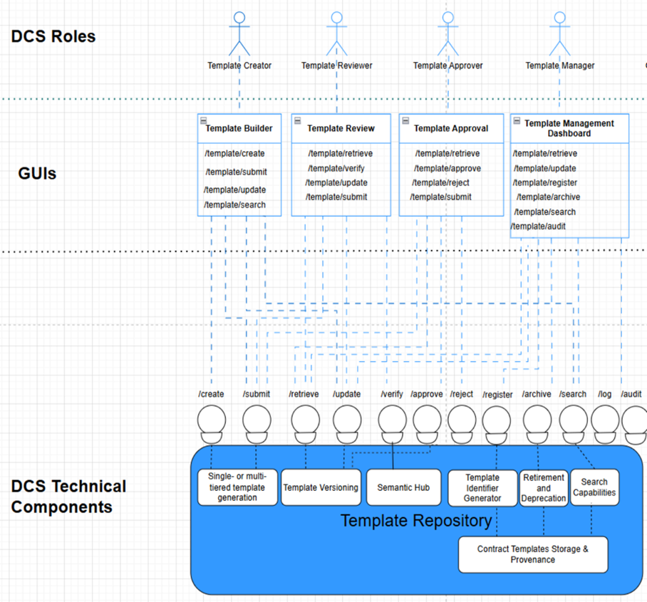
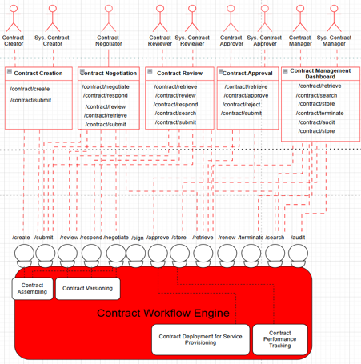
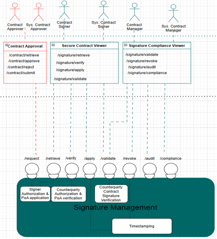
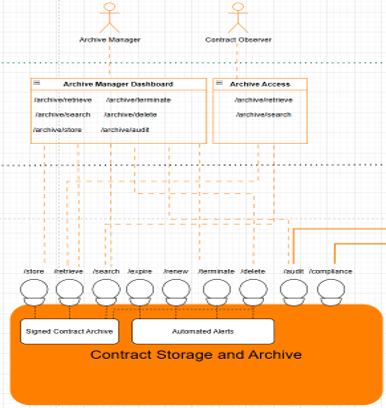
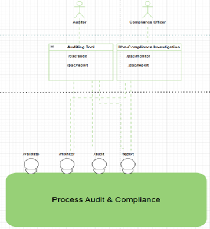

[← Product Overview](02_product_overview.md) · [↑ Table of Contents](../README.md) · [System Features →](04_system_features.md)

---

## 3 Requirements

Requirements are prefixed ‘DCS-IR’ for interfaces, ‘DCS-FR’ for functionality, and ‘DCS-NFR’ for non-functional requirements, with component codes (e.g., TR, CWE, SM, CSA, PACM) appended to functional requirements where applicable.

### 3.1 Interfaces

#### 3.1.1 User Interfaces

This section defines the DCS’s user interfaces and flows for the user classes defined in Section 2.4.

##### 3.1.1.1 Template Repository

<em>Fig.5 – Template Repository functional overview and UI</em>

- As shown in Fig.5, Template Repository contains the following user interfaces: Template Builder, Template Review, Template Approval, and Template Management Dashboard. The requirements, pre-conditions, steps, post-conditions, and the logical characteristics of these user interfaces are provided in this section.   

**Template Builder**  

**UI Requirements**

[DCS-IR-TR-01] Template Builder MUST allow Template Creator to create new contract templates and update existing ones.

[DCS-IR-TR-02] Template Builder MUST allow searching and retrieving existing templates for reuse or modification.   

**Pre-conditions** 
- Users assigned with Template Creator are authenticated with permissions to manage templates.
- Required metadata schemas, libraries, and semantic conditions are available and accessible.

**Steps**
1. Open Template Builder interface from the dashboard.
2. Enter template details, including metadata, clauses, and semantic conditions.
3. Optionally, search for existing templates by keyword, category, or metadata.
4. Update or refine template content as needed.
5. Submit the template for review and approval.

**Post-conditions**

- Draft template is stored in the repository with provenance tracking (see [DCS-FR-TR-08]).
- Submission generates a review task, assigned to the appropriate Template Reviewer.
- A unique identifier is assigned to the template for traceability.

**Logical Characteristics**

- Layout: Form-based interface with structured fields for metadata and clause insertion.
- Controls: Standard buttons (Create, Update, Save Draft, Submit, Cancel, Help).
- Error Handling: Inline validation for required fields; error messages displayed contextually.
- Usability & Accessibility: Search bar with autocomplete; support for keyboard shortcuts
- Audit Hooks: Every action logged with timestamp and user ID for compliance.
- Security: Role-based access control to prevent unauthorized template management.

**Template Review**  

**UI Requirements**

[DCS-IR-TR-03] Template Review MUST allow Reviewers to retrieve, verify, update, and submit templates.  

[DCS-IR-TR-04] Template Review MUST support forwarding a verified template to approval or returning it to draft with comments. 

**Pre-conditions**

- A template exists in Submitted state.
- Reviewer is authenticated and authorized to review templates.
- Required validation rules (policy, semantic, schema) are available.

**Steps**

1. Retrieve the submitted template.
2. Verify content (policy checks, semantic/SHACL validation, schema completeness).
3. Optionally update metadata/clauses/semantic conditions or add review comments.
4. Either Forward to Approval or Return to Draft with comments.
5. Submit changes.

**Post-conditions**

- If accepted: template transitions to Approval state.
- If changes required: template transitions to Draft with reviewer comments and assigned tasks.
- All actions are logged with timestamp, user ID, and rationale.

**Logical Characteristics**

- Layout: Split view with (a) template details & metadata, (b) clause/semantic editor, (c) validation results panel, (d) comment thread.
- Controls: Retrieve, Verify, Save, Submit, Forward to Approval, Return to Draft, Cancel, Help.

- Validation & Errors: Inline field errors; non-blocking warnings; blocking errors for failed policy/semantic checks; retry guidance.
- Usability & Accessibility: Keyboard navigation, clear focus states, ARIA roles, WCAG-compliant contrast.
- Audit Hooks: View, verify, edit, submit, state-transition, and comment events logged.
- Security: RBAC; redact sensitive fields in comments/export; immutable audit for state changes.

**Interface Endpoints**

- GET /template/retrieve – load submitted template and history/provenance summary.
- POST /template/verify – run policy, schema, and semantic validations; return findings.
- PUT /template/update – persist reviewer edits (metadata/clauses/semantics).
- POST /template/submit – with action flag { forwardTo: "approval" | "draft" } and optional reviewComments.

**Template Approval UI**  

**Requirements**

[DCS-IR-TR-05] Template Approval MUST allow Approvers to retrieve, approve, reject, or resubmit templates.  

[DCS-IR-TR-06] Template Approval MUST ensure that only validated templates enter the pool of contractready assets.  

**Pre-conditions**

- A template exists in Reviewed state.
- Approver is authenticated and authorized to approve templates.
- Review history and comments are accessible for decision-making.

**Steps**
1. Retrieve the reviewed template.
2. Inspect review results, comments, and validation reports.
3. Decide: Approve (template becomes contract-usable), Reject (return to draft with reasons), or Request Resubmission (minor issues flagged).
4. Submit decision.

**Post-conditions**

- Approved: Template transitions to Approved state and becomes selectable in Contract Creation.
- Rejected: Template transitions to Draft with approver’s rejection reason attached.
- Resubmission: Template transitions to Submitted with comments for another review cycle.
- All actions are logged with timestamp, user ID, and rationale.

**Logical Characteristics**

- Layout: Template details, validation results panel, comment history, and decision buttons.
- Controls: Approve, Reject (with reason input), Request Resubmission, Save, Cancel, Help.
- Validation & Errors: Prevents approval if mandatory metadata/clauses are missing; requires textual reason for rejection/resubmission.
- Usability & Accessibility: Keyboard shortcut for quick decisioning, accessible error messages, consistent placement of action buttons.
- Audit Hooks: Approver identity, timestamp, decision, and rationale captured.
- Security: RBAC enforcement; read-only access to provenance data; immutable logging of decisions.

**Interface Endpoints**

- GET /template/retrieve – fetch reviewed template with metadata, review history, and validation results.
- POST /template/approve – mark template as approved, with optional decision notes.
- POST /template/reject – mark template as rejected, requiring reason field.
- POST /template/submit – allow resubmission path with approver comments.

**Template Management Dashboard UI**  

**Requirements**

[DCS-IR-TR-07] Template Management Dashboard MUST allow Managers to register, archive, update, search, and audit templates.

[DCS-IR-TR-08] Template Management Dashboard MUST provide lifecycle oversight of all templates in the repository. Pre-conditions

- User is authenticated with Manager role.
- Template repository is available with searchable metadata and audit logs.

**Steps**
1. Access dashboard view of all templates (with filters: status, owner, date, version, etc.).
2. Perform actions:

- a. Register a new template into the repository.
- b. Update metadata or classifications.
- c. Archive obsolete templates.
- d. Search by identifiers, keywords, or semantic conditions.
- e. Audit template history for provenance and compliance.
3. Confirm changes or run audit reports.

**Post-conditions**

- Repository updated with new/modified/archived template entries.
- Full audit trail logged for all management actions.
- Dashboard reflects the latest template lifecycle state.

**Logical Characteristics**

- Layout: Central table/list of templates with filters, status indicators, and action buttons.
- Controls: Register, Update, Archive, Search, Audit, Export (CSV/PDF), Help.
- Validation & Errors: Prevents duplicate registration; blocks archiving of active templates still in use; requires justification text for archival.
- Usability & Accessibility: Batch operations (multi-select), search bar with auto-suggest, sortable columns, role-based tooltips.
- Audit Hooks: Logs who registered/updated/archived a template, with timestamps and rationale.

- Security: RBAC enforced; managers cannot alter provenance history; sensitive audit logs are readonly.

**Interface Endpoints**

- GET /template/retrieve – fetch all template entries for dashboard view.
- POST /template/update – update metadata or status.
- POST /template/register – register new template into the repository.
- POST /template/archive – archive obsolete template.
- GET /template/search – perform filtered searches.
- GET /template/audit – retrieve audit history of template actions.

##### 3.1.1.2 Contract Workflow Engine

<em>Fig.6 – Contract Workflow Engine functional overview and UI</em>

- As shown in Fig.6, Contract Workflow Engine contains the following interfaces: Contract Creation, Contract Negotiation, Contract Review, Contract Approval, and Contract Management Dashboard. The requirements, pre-conditions, steps, post-conditions, and the logical characteristics of these user interfaces are provided in this section.  
**Contract Creation**  

**Requirements**

[DCS-IR-CWE-01] Contract Creation UI MUST allow Contract Creators to create and submit contracts from approved templates.

[DCS-IR-CWE-02] Contract Creation UI MUST enable population of contract data, including parties, assets, policies, and evidence.

**Pre-conditions**

- At least one approved template exists in the Template Repository.
- User is authenticated and authorized with Contract Creator role.
- Required metadata schemas and identity verification services are available.

**Steps**
1. Access Contract Creation module.
2. Select an approved template from the repository.
3. Fill in required fields (e.g., contracting parties, assets/services, usage policies, semantic clauses).
4. Attach evidence or supporting credentials (e.g., company license, role-based PoA).
5. Validate draft against schema and policy checks.
6. Submit contract for negotiation or review.

**Post-conditions**

- Contract stored as draft (if incomplete) or as a submitted item ready for further workflow.
- Contract provenance (creator, timestamp, version, linked template ID) is logged.
- Notifications are sent to designated reviewers or counterparties. Logical Characteristics
- Layout: Form-based UI with sections for parties, assets, policies, evidence attachments, and preview pane.
- Controls: Save draft, Validate, Submit, Attach credential, Help.
- Validation & Errors: Ensures all mandatory fields (parties, expiration date, jurisdiction, etc.) are completed; highlights semantic inconsistencies.
- Usability: Auto-fill for known parties/assets, drag-and-drop evidence attachment, guided templatebased wizard.
- Audit Hooks: Logs all creation events, including metadata, drafts, and submission actions.
- Security: Enforces RBAC for contract creation; sensitive evidence data encrypted at rest.

**Interface Endpoints**

- POST /contract/create – initiate new contract draft from template.
- POST /contract/submit – finalize and submit contract for negotiation/review.

**Contract Negotiation** 

**Requirements**

[DCS-IR-CWE-03] Contract Negotiation UI MUST allow parties to exchange responses, redlines, and comments prior to contract approval.

[DCS-IR-CWE-04] Contract Negotiation UI MUST support comparison of contract versions for transparency and traceability. 

**Pre-conditions**

- A contract exists in negotiation state.
- Both parties are authenticated and authorized with appropriate roles (e.g., Contract Creator/Reviewer).

- Versioning and provenance tracking are enabled.

**Steps**
1. Retrieve current contract version.
2. Compare changes with prior versions (diff view).
3. Propose modifications (redlines, comments, clause edits).
4. Respond to counterpart proposals.
5. Validate draft against schema and policy rules.
6. Submit negotiated version for further review/approval.

**Post-conditions**

- An agreed version is forwarded to review or approval workflow.
- Contract provenance is updated with version history, actors, and timestamps.
- Notifications are issued to involved parties upon submission.

**Logical Characteristics**

- Layout: Side-by-side or inline diff view of clauses and policies; comment thread panel.
- Controls: Accept/Reject change, Propose change, Save draft, Compare versions, Submit.
- Validation & Errors: Detects conflicting edits or policy violations (e.g., exceeding jurisdiction scope).
- Usability: Highlighted redlines, inline commenting, track changes history, revert function.
- Audit Hooks: Immutable record of all negotiation steps, linked to contract ID.
- Security: Role-based permissions; ensures only authorized parties can propose or accept changes.

**Interface Endpoints**

- POST /contract/negotiate – propose changes.
- POST /contract/respond – respond to counterpart changes.
- GET /contract/review – retrieve latest draft for comparison.
- POST /contract/submit – finalize and submit negotiated version.

**Contract Review**  

**Requirements**

[DCS-IR-CWE-05] Contract Review UI MUST allow Reviewers to retrieve, inspect, and validate contracts after negotiation.

[DCS-IR-CWE-06] Contract Review UI MUST allow Reviewers to respond with findings, request modifications, or forward contracts for approval.

[DCS-IR-CWE-07] Contract Review UI MUST provide search capabilities to locate contracts by metadata, parties, or template references. 

**Pre-conditions**

- A contract exists in submitted state after negotiation.
- Reviewer role is authenticated and authorized.
- Semantic and policy validation rules are available.
1. Retrieve submitted contract.
2. Verify content against policy and semantic checks (e.g., jurisdiction, expiration, SLA clauses).
3. Search or filter related contracts if needed for comparison.
4. Respond with findings, request changes, or annotate clauses.
5. Forward contract to approval or return it to negotiation.

**Post-conditions**

- Contract is either advanced to approval state or reverted to negotiation state with Reviewer comments.
- Validation and review outcome are logged in the audit trail.
- Parties are notified of the decision.

**Logical Characteristics**

- Layout: Contract viewer with clause highlighting; policy/semantic check results shown in a validation pane.
- Controls: Approve for forwarding, Request changes, Add comments, Save review draft, Submit decision.
- Validation & Errors: Automated semantic validation flags missing/invalid attributes.
- Usability: Inline annotations, search/filter bar, compare to prior version option.
- Audit Hooks: Every review action is timestamped, signed, and appended to the contract provenance.
- Security: Role-restricted access; Reviewer signatures required for completed reviews. Interface Endpoints
- GET /contract/retrieve – fetch submitted contract.
- POST /contract/respond – provide feedback/findings.
- GET /contract/search – locate contracts by metadata or state.
- POST /contract/submit – finalize review outcome. 

**Contract Approval**  

**Requirements**

[DCS-IR-CWE-08] Contract Approval UI MUST allow Approvers to retrieve contracts in reviewed state.

[DCS-IR-CWE-09] Contract Approval UI MUST allow Approvers to approve, reject (with reason), or resubmit contracts.

[DCS-IR-CWE-10] Contract Approval UI MUST ensure approved contracts are forwarded into the signing workflow and catalogue. 

**Pre-conditions**

- Contract exists in reviewed state.
- Approver role is authenticated and authorized.
- Validation results from Review stage are available.

**steps**

1. Retrieve the reviewed contract.
2. Inspect contract metadata, negotiation history, and reviewer findings.
3. Approve or reject the contract, optionally setting visibility rules (e.g., catalogue availability, restricted access).
4. Submit decision to finalize state.

**Post-conditions**

- Approved contract is available for signing workflow and registered in the catalogue.
- Rejected contract is returned to negotiation with Approver comments.
- All approval actions are logged in the audit trail with timestamp and Approver identity.

**Logical Characteristics**

- Layout: Contract approval panel with decision buttons (Approve, Reject, Resubmit) and visibility settings.
- Controls: View full contract text, access metadata, open reviewer comments, Approve, Reject (with reason box), Submit.
- Validation & Errors: Warning if mandatory fields, clauses, or signatories are missing.
- Usability: Inline review history, searchable contract metadata, visibility selector.
- Audit Hooks: Approval decision is signed digitally by Approver and appended to provenance log.
- Security: Restricted to Approvers; strong authentication required.

**Interface Endpoints**

- GET /contract/retrieve – fetch reviewed contract.
- POST /contract/approve – approve and forward contract.
- POST /contract/reject – reject with explanation.
- POST /contract/submit – finalize decision.

**Contract Management Dashboard**  

**Requirements**

[DCS-IR-CWE-11] Contract Management Dashboard UI MUST allow Managers to retrieve and search contracts across lifecycle states.

[DCS-IR-CWE-12] Contract Management Dashboard UI MUST allow Managers to store evidence, terminate contracts, and perform audits.

[DCS-IR-CWE-13] Contract Management Dashboard UI MUST provide lifecycle monitoring aligned with XFSC lifecycle/log token usage. 

**Pre-conditions**

- Manager role is authenticated and authorized.
- Contracts exist in the system across one or more states.

**Steps**
1. Retrieve and filter contracts by state (All, Drafts, In Review, Approved, Expired).
2. Select a contract to perform actions:

    - a. Terminate contract

    - b. Store supporting evidence (files, metadata).
    - c. Run audit (view lifecycle, compliance, and log data).
3. Submit updates or actions.

**Post-conditions**

- Contract lifecycle state updated (e.g., terminated).
- Evidence stored and linked to the contract.
- Audit results appended to log records and accessible in compliance reports.

**Logical Characteristics**

- Layout: Dashboard with tabs/filters for lifecycle states and a detail pane for selected contract actions.
- Controls: Search bar, filters, buttons for Terminate, Store Evidence, Run Audit.
- Validation & Errors: System warns if evidence is missing or if termination reason not provided.
- Usability: One-click filtering, sortable contract lists, role-based access.
- Audit Hooks: All Manager actions digitally signed and logged with timestamp.
- Security: Strict access limited to Managers; evidence integrity enforced.

**Interface Endpoints**

- GET /contract/retrieve – fetch contract(s).
- GET /contract/search – filter/search across lifecycle states.
- POST /contract/terminate – terminate a contract.
- POST /contract/audit – generate audit record.
- POST /contract/store – store evidence.

##### 3.1.1.3 Signature Management

<em>Fig.7 – Signature Management functional overview and UI</em>

- As shown in Fig.7, Signature Management component contains the following user interfaces: Secure Contract Viewer and Signature Compliance Viewer. The requirements, pre-conditions, steps, post-conditions, and the logical characteristics of these user interfaces are provided in this section.

**Secure Contract Viewer**  

**Requirements**

[DCS-IR-SM-01] Secure Contract Viewer UI MUST allow Signers and Managers to retrieve approved contracts prepared for signing.

[DCS-IR-SM-02] Secure Contract Viewer UI MUST allow verification of contract integrity and signature envelopes.

[DCS-IR-SM-03] Secure Contract Viewer UI MUST allow applying signatures with appropriate credentials (e.g., QES/AES with PoA if required).

[DCS-IR-SM-04] Secure Contract Viewer UI MUST allow validation of applied signatures to ensure compliance and integrity.  

**Pre-conditions**

- Contract is approved for signing state.
- Signer/Manager role authenticated with valid signing rights.
- Signature envelope (metadata, policies, required signers) is available.

**Steps**
1. Retrieve contract and associated signature envelope.
2. Verify contract content integrity and required signing policies.
3. Apply signature using assigned credentials.
4. Validate applied signature(s) against trust policies.
5. Confirm submission of executed contract.

**Post-conditions**

- Executed contract stored in system with applied signatures.
- Validation artifacts (cryptographic proofs, timestamp, signer ID) linked to contract.
- Audit log updated with retrieval, verification, signature, and validation actions.

**Logical Characteristics**

- Layout: Split-view screen: contract content viewer on left, signature actions panel on right.
- Controls: Buttons for Verify, Apply Signature, Validate, Submit.
- Feedback: Validation results displayed (success, warnings, or errors with details).
- Error Handling: Alerts if signer lacks valid credentials, contract integrity fails, or validation fails.
- Security: End-to-end encryption of contract during retrieval, signature application, and storage.
- Usability: Step-by-step guided signing wizard; role-based interface adaptation.

**Interface Endpoints**

- GET /signature/retrieve – fetch contract & envelope.
- POST /signature/verify – check contract integrity & envelope.
- POST /signature/apply – apply digital signature.
- POST /signature/validate – validate applied signature.

**Signature Compliance Viewer**  

**Requirements**

[DCS-IR-SM-05] Signature Compliance Viewer UI MUST allow compliance users to validate trust anchors, cryptographic proofs, and timestamps of signatures.

[DCS-IR-SM-06] Signature Compliance Viewer UI MUST allow revocation of signatures if required (e.g., signer credentials revoked, policy breach).

[DCS-IR-SM-07] Signature Compliance Viewer UI MUST allow running compliance checks against applicable policies, standards (eIDAS, ETSI), and business rules.

[DCS-IR-SM-08] Signature Compliance Viewer UI MUST allow generating audit reports covering validation and compliance results. 

**Pre-conditions**

- A signed contract exists in the system.
- Compliance role (e.g., Auditor, Compliance Officer) is authenticated.
- Revocation list or registry is accessible (XFSC-compatible or external TSP).   

**Steps**
- Retrieve signed contract and associated validation data.
- Validate trust anchors, cryptographic integrity, and timestamp validity.
- If applicable, revoke signature and record reason.
- Run compliance checks against defined standards/policies.
- Generate and export compliance/audit report. 

**Post-conditions**
- Compliance report recorded and linked to the contract.
- Revocation status updated in contract record and revocation registry.
- Audit trail extended with validation, revocation, and compliance events.  

**Logical Characteristics**
- Layout: Dashboard view with tabs: Validation, Revocation, Compliance Checks, Audit Reports.
- Controls: Buttons for Validate, Revoke, Run Compliance, Export Report.
- Feedback: Real-time compliance results with clear pass/fail indicators and detailed findings.
- Error Handling: Notifications if trust registry unreachable, revocation list unavailable, or compliance checks fail.
- Usability: Filter and search signed contracts by compliance status; export audit reports as PDF and JSON.

**Interface Endpoints**

- POST /signature/validate – validate contract signature(s).
- POST /signature/revoke – revoke a signature.
- GET /signature/audit – retrieve compliance/audit logs.
- POST /signature/compliance – run compliance check.

##### 3.1.1.4 Contract Storage and Archive

<em>Fig.8 – Contract Storage and Archive functional overview and UI</em>

- As shown in Fig.8, Contract Storage and Archive component contains the following user interfaces: Archive Manager Dashboard and Archive Access. The requirements, pre-conditions, steps, post-conditions, and the logical characteristics of these user interfaces are provided in this section.   

**Archive Manager Dashboard**  

**Requirements**

[DCS-IR-CSA-01] Archive Manager Dashboard UI MUST allow Archive Managers to retrieve and search archived contracts and related records.

[DCS-IR-CSA-02] Archive Manager Dashboard UI MUST allow storing new contracts and evidence in the archive.

[DCS-IR-CSA-03] Archive Manager Dashboard UI MUST allow terminating or deleting archived entries under defined policies.

[DCS-IR-CSA-04] Archive Manager Dashboard UI MUST allow running audits on archive operations and integrity.   

**Pre-conditions**

- Archive service is configured and operational.
- Archive Manager role is authenticated with necessary privileges.
- Retention and deletion policies are available in the system.

**Steps**
1. Retrieve and search archived contracts or evidence.
2. Store new items (contracts, signatures, compliance reports) into archive.
3. Terminate or delete entries in accordance with policy.
4. Run audit report for archive activities and integrity validation.

**Post-conditions**

- Tamper-evident archive updated with new, modified, or removed items.
- Audit log extended with retrieval, storage, termination, and deletion events.
- Archive state synchronized with compliance and retention policies.

**Logical Characteristics**

- Layout: Dashboard view with panels for Retrieve/Search, Store, Terminate/Delete, Audit.
- Controls: Buttons for Store New Entry, Terminate, Delete, Run Audit Report.
- Feedback: Confirmation dialogs for termination/deletion; alerts on policy violations.
- Error Handling: Notifications if archive storage is full, unavailable, or policy prevents deletion.
- Usability: Advanced search (by contract ID, signer, date, status); exportable audit reports.

**Interface Endpoints**

- GET /archive/retrieve – retrieve archived items.
- POST /archive/store – store new contract or evidence.
- POST /archive/terminate – terminate contract/archive entry.
- DELETE /archive/delete – permanently delete entry.
- GET /archive/search – search archived records.
- GET /archive/audit – retrieve audit logs.

**Archive Access**  

**Requirements**

[DCS-IR-CSA-05] Archive Access UI MUST allow Observers to retrieve and search archived contracts and records with least-privilege access.

[DCS-IR-CSA-06] Archive Access UI MUST ensure that read-only users cannot modify, terminate, or delete entries.   

**Pre-conditions**

- Observer role is authenticated and authorized.
- Archive service is operational.

**Steps**
1. Retrieve archived records.
2. Filter results by metadata (e.g., contract ID, date, status, party).
3. View contract or evidence in read-only mode.

**Post-conditions**

- No changes made to archive state.
- All access events logged to audit trail.

**Logical Characteristics**

- Layout: Simplified dashboard or portal view with search bar and result table.
- Controls: Search, Filter, Export (PDF and JSON).
- Feedback: Read-only access notification; error messages if attempting restricted actions.
- Usability: Advanced search with filters for contract metadata; role-specific minimal UI.
- Convenience: Quick export/download option for permitted formats.

**Interface Endpoints**

- GET /archive/retrieve – retrieve archived items.
- GET /archive/search – search records by criteria.

##### 3.1.1.5 Process Audit and Compliance Management

- As shown in Fig.9, Process Audit and Compliance Management component contains the following user interfaces: Auditing Tool and Non-Compliance Investigation. The requirements, pre-conditions, steps, postconditions, and the logical characteristics of these user interfaces are provided in this section.

<em>Fig.9 – Contract Storage and Archive functional overview and UI</em>

**Auditing Tool**  

**Requirements**

[DCS-IR-PACM-01] Auditing Tool UI MUST allow Auditors to initiate audits across contracts, templates, and signatures.

[DCS-IR-PACM-02] Auditing Tool UI MUST provide reporting capabilities with exportable audit results.   

**Pre-conditions**

- Auditor role authenticated and authorized.
- Audit scope, rules, and policies configured in system.

**Steps**
1. Select audit scope (templates, contracts, signatures, or archive).
2. Execute audit via /pac/audit.
3. Review findings in dashboard (violations, inconsistencies, compliance checks).
4. Generate structured audit report via /pac/report.

**Post-conditions**

- Audit results and reports stored in tamper-proof log.
- Findings linked to relevant contract or template IDs.

**Logical Characteristics**

- Layout: Dashboard with filters (date, module, scope).
- Controls: Run Audit, Export Report, View Findings.
- Feedback: Real-time progress indicator; error messages for failed checks.
- Usability: Drill-down into individual findings; severity level indicators.
- Convenience: Report export in multiple formats (PDF, CSV, JSON).

**Interface Endpoints**

- POST /pac/audit – trigger an audit on selected scope.
- GET /pac/report – generate and retrieve audit reports.

**Non-Compliance Investigation**  

**Requirements**

[DCS-IR-PACM-03] Non-Compliance Investigation UI MUST allow Compliance Officers to continuously monitor events and policy adherence.

[DCS-IR-PACM-04] Non-Compliance Investigation UI MUST allow incident reporting and linking findings to affected contracts or templates.  

**Pre-conditions**

- Monitoring rules and thresholds defined.
- Compliance Officer role authenticated and authorized.

**Steps**
1. Access monitoring dashboard via /pac/monitor.
2. Review detected policy breaches, anomalies, or flagged events.
3. Document incident details and attach supporting evidence.
4. Submit findings via /pac/report.

**Post-conditions**

- Non-compliance case created with unique identifier.
- References to affected contracts, templates, or signatures stored.
- Case status visible in compliance dashboard. 

**Logical Characteristics**
- Layout: Incident dashboard showing event streams, filters, severity levels.
- Controls: Monitor, Flag Incident, Generate Report, Link to Contract.
- Feedback: Alert notifications for detected breaches; confirmation of report submission.
- Usability: Drill-down from high-level alerts into specific event data.
- Convenience: Case export for external regulatory submission.

**Interface Endpoints**

- GET /pac/monitor – continuous monitoring and event retrieval.
- POST /pac/report – submit non-compliance findings as case records.

#### 3.1.2 Hardware Interfaces

##### [DCS-IR-HI-01] Interface for Use of Signing Secrets (HSM/QSCD/TPM)   
Private keys and other service secrets used by DCS MUST be protected by hardware security mechanisms (e.g., HSM, QSCD, or TPM/Secure Enclave), using standardized interfaces, with secrets held in a nonexportable, tamper-resistant manner; the solution SHOULD support operation in virtualized/containerized environments without weakening hardware protection.

##### [DCS-IR-HI-02] FIDO2 Security Key Interface  
DCS web clients MUST support hardware authenticators (USB/NFC/BLE security keys or platform authenticators) for phishing-resistant login and step-up approval, using standard browser APIs (WebAuthn) with keys remaining protected in the device.

##### [DCS-IR-HI-03] Platform TPM 2.0 / Secure Enclave Interface    
DCS services MUST be able to protect service credentials by sealing them to a platform hardware root of trust (TPM 2.0 or Secure Enclave) and SHOULD support remote attestation to prove platform integrity prior to enabling sensitive operations.

#### 3.1.3 Software Interfaces

##### [DCS-IR-SI-01] Template Catalogue Integration   
An interface MUST be provided between the TR and the XFSC Catalogue for template discovery, request, and registration via application APIs.

##### [DCS-IR-SI-02] Workflow Orchestration (Node-RED) Integration   
An interface MUST be provided between the CWE and the XFSC Orchestration Engine (Node-RED) exposing Node-RED–compatible endpoints and webhook callbacks for automated workflow invocation.

##### [DCS-IR-SI-03] Platform Authentication & Authorization Integration   
Interfaces MUST be provided between all DCS components and the Authentication & Authorization Service implementing OAuth2/OIDC flows for service-to-service and user access control.

##### [DCS-IR-SI-04] Wallet & TSP Signing Integration    
An interface MUST be provided between SM and identity wallets and TSPs supporting OpenID4VCI/4VP for credential issuance/presentation and remote AES/QES signing and validation.

##### [DCS-IR-SI-05] External Target System API Integration   
An interface MUST be provided between DCS (CWE/SM/CSA) and external target systems (e.g., ERP or AI services) exposing contract-processing and automated-interaction APIs for create/deploy actions, status queries, and event callbacks.

##### [DCS-IR-SI-06] Counterparty DCS Information Endpoint      
An interface MUST be provided between a DCS instance and a counterparty DCS offering a policy-gated, read-only contract information endpoint.

##### [DCS-IR-SI-07] OpenID Provider Discovery & JWKS Consumption    
An interface MUST be provided between the DCS Authentication & Authorization Service and external OpenID Providers (IdPs) to consume discovery metadata and JWKS for token validation.

##### [DCS-IR-SI-08] OpenID4VP Login & Access Control   
An interface MUST be provided between the DCS Authentication & Authorization Service and identity wallets to accept OpenID4VP verifiable presentations of authorization credentials for login and access control.

##### [DCS-IR-SI-09] Credential Status & Revocation Service     
An interface MUST be provided between DCS and a status/revocation list service to check and update credential status during validation and enforcement.

##### [DCS-IR-SI-10] Digital Signature Service (DSS) Authorization & Signing    
An interface MUST be provided between SM and a DSS to authorize and execute remote AES/QES operations and return signature artifacts and timestamps.
##### [DCS-IR-SI-11] Relational Database Access 
An interface MUST be provided between DCS components and the relational database (e.g., PostgreSQL) for CRUD access to shared entities using versioned schemas and migrations.

##### [DCS-IR-SI-12] Crypto Provider & DID/VC Operations    
An interface MUST be provided between DCS and the Crypto Provider Service to create/verify DID documents and perform VC/VP signing and verification required by wallet integrations.

#### 3.1.4 Communications Interfaces

##### [DCS-IR-CI-01] HTTPS/TLS 1.3 Transport    
All external service communications for DCS MUST use HTTPS over TLS 1.3 for confidentiality and integrity.

##### [DCS-IR-CI-02] REST/JSON API Conventions  
All application APIs MUST follow REST semantics with application/json request/response bodies; binary artifacts (e.g., signed PDFs) MUST be served as application/pdf. This applies to the signature and archive endpoints already defined.

##### [DCS-IR-CI-03] Browser Access over HTTPS    
All web UI interactions (Template, Workflow, Signature, Archive, PACM) MUST be delivered via HTTPS, with no additional non-web protocols required.

##### [DCS-IR-CI-04] OAuth2/OIDC Flows  
DCS MUST implement OAuth2/OIDC authorization, token, and introspection flows for both user and service access to APIs.

##### [DCS-IR-CI-05] OpenID Discovery & JWKS      
DCS MUST consume well-known OpenID Provider discovery metadata and JWKS endpoints for token and client validation.

##### [DCS-IR-CI-06] OpenID4VC/VP Bindings     
Wallet interactions MUST use OpenID4VCI for issuance and OpenID4VP for presentation during login/authorization and signing flows.

##### [DCS-IR-CI-07] Orchestration Webhooks   
Workflow invocation and callbacks between the XFSC Orchestration Engine (Node-RED) and DCS MUST use HTTP(S) endpoints and webhooks compatible with Node-RED nodes.

##### [DCS-IR-CI-08] DSS Remote Signing over HTTPS      
Remote AES/QES operations with a DSS or TSP MUST be invoked over HTTPS and return standard signature containers.

##### [DCS-IR-CI-09] Revocation List Synchronization    
Credential and contract-status checks MUST query a compatible revocation/status list service; updates to published status MUST be reflected within ≤ 5 minutes.
##### [DCS-IR-CI-10] PACM Audit Event Transport  
Audit and compliance operations MUST use HTTPS JSON endpoints for event submission and report retrieval (/pac/audit, /pac/report).

### 3.2 Functional Requirements

#### 3.2.1 Template Repository

##### [DCS-FR-TR-01] Machine-Readable Format     
The Template Repository facilitates the structured storage and management of contract templates in machine readable source forms. Ensuring contract templates in machine-readable forms allows for automation and validation across digital contracting systems. Thus, the repository MUST store contract templates in structured, machine-readable formats. This does not indicate that the repository needs to be open to arbitrary contract languages.

##### [DCS-FR-TR-02] Multi-Tiered Contract Template Management     
The Template Repository MUST support hierarchical contract structures, including Frame Agreements, Sub Agreements, and Addendums as digital contracts often involve multiple levels of agreements, requiring structured template management that allows customization at different levels. Examples include contract schemas, credential schemas, provenance schemas, and trust chaining schemas.

##### [DCS-FR-TR-03] Semantic Hub for Schema Storage    
The Semantic Hub facilitates standardization and interoperability across different contract templates by providing a structured schema repository for validation and compliance. For this reason, the repository MUST include a Semantic Hub to store schemas supporting machine-readable formats, such as SHACL shapes and JSON-LD contexts, ensuring interoperability and extensibility. The Semantic Hub MUST also support versioning of the schemas.

##### [DCS-FR-TR-04] Machine-Readable and Human-Readable Template Linking   
All templates MUST have a bidirectional link between machine-readable and human-readable formats.

##### [DCS-FR-TR-05] Template Version Control     
The Template Repository MUST track changes, versions, and approvals for each template. These tracked changes MUST be made available for logging, monitoring, auditing, and reporting purposes to ensure compliance, transparency, and dispute resolution among evolving contract templates. The versions, changes, and approvals can be logged into an external system.

##### [DCS-FR-TR-06] Role-Based Access Control for Template Repository  
The system must implement RBAC to restrict template access and modifications according to user roles, ensuring that only authorized personnel can create, approve, or retrieve templates. RBAC will be managed through role assertions in the form of verifiable credentials stored in users' wallets, which will be presented during the authentication and authorization process. This approach prevents unauthorized alterations that could lead to errors, compliance risks, or unintended contract modifications. Specifically, it ensures that only Template Managers can create templates, Template Approvers can approve them, Template Reviewers can review them, and Template Creators can initiate their creation.

##### [DCS-FR-TR-07] Compliance & Legal Validation

The Template Repository MUST validate templates against regulatory frameworks before they can be used in contract creation, with the specific frameworks depending on the use case domain. This validation ensures that contract templates meet legal and compliance requirements before they are applied in digital agreements, adhering to the relevant regulations for each domain. The validation occurs over the process audit and compliance component of the Digital Contracting Service, which provides access to a user with the Compliance Officer role over the non-compliance investigation tool.

##### [DCS-FR-TR-08] Provenance Tracking    
The repository MUST maintain provenance tracking for all contract templates, recording their creation, modifications, approvals, and historical versions to prevent unauthorized modifications and enabling verification of the contract's legal history. “Provenance” means being able to track who created, modified, reviewed, or approved a template at each step with logged data. It MUST be ensured that each role – template creator, template reviewer, template approver, and template manager – leaves a traceable record when interacting with the template.

##### [DCS-FR-TR-09] Template Provenance and Versioning     
The repository MUST support the ability for a Template Creator, Reviewer, and Approver to add provenance claims to each template version. Provenance and versioning assertions MUST be linked and MUST be verifiable using W3C VCs in JSON-LD. Template users MUST be able to verify the provenance of a given template by verifying the template provenance credentials.

##### [DCS-FR-TR-10] Searchable Metadata & Categorization   
In order to enable organizations to find appropriate templates, the repository MUST allow advanced searching based on metadata such as contract type, jurisdiction, industry, and regulatory compliance status.

##### [DCS-FR-TR-11] Template UUID / DID Assignment     
Each contract template MUST have a UUID or DID to ensure its traceability across contract workflows, providing consistency and authenticity when templates are referenced in negotiations, agreements, and compliance audits.

##### [DCS-FR-TR-12] Template Customization      
The repository SHOULD support dynamic placeholders and automated population of contract terms based on predefined SLA rules, reducing manual input errors and enhancing efficiency by allowing templates to automatically adjust to specific service agreements.

##### [DCS-FR-TR-13] Template Creation  
The system MUST allow a Template Manager to register a new contract template via the /template/register endpoint to ensure that only authorized personnel can create and manage contract templates.

##### [DCS-FR-TR-14] Template Submission for Approval   
The system MUST enforce an approval workflow where a Template Manager submits a newly created template for review by a Template Approver, ensuring that all templates meet quality and compliance standards before being made available for use.

##### [DCS-FR-TR-15] Template Approval Process  
The system MUST allow a Template Approver to review, approve, or reject a submitted template via a dedicated approval interface, preventing unapproved or incorrect templates from being used in contract workflows.

##### [DCS-FR-TR-16] Template Update Management   
The repository MUST allow authorized users to update existing contract templates while maintaining version history and linking updates to previous versions, ensuring continuity and transparency in template evolution by tracking modifications and preserving historical versions for auditability. The entire history can be maintained by an external system.

##### [DCS-FR-TR-17] Template Retirement and Deprecation    
The repository MUST support the deprecation and retirement of contract templates, ensuring that outdated versions are archived and no longer used in new contracts, while maintaining compliance and contract integrity through the preservation of historical records for reference and audits.

##### [DCS-FR-TR-18] Template Deletion  
The system MUST allow a Template Manager to delete a deprecated template, preventing outdated templates from being used. The deletion process may be subject to specific compliance requirements that are out of scope.

##### [DCS-FR-TR-19] Template Retrieval     
The system MUST allow a Template User to retrieve an approved template via the /template/retrieve/{template_id} endpoint to ensure that only approved and active templates are used in contract workflows.

##### [DCS-FR-TR-20] Template Compliance and Integrity Verification     
The system MUST provide an endpoint (/template/verify/{template_id}) that enables Template Users to verify the integrity and compliance of a retrieved template, ensuring that it adheres to regulatory standards and has not been altered since approval.

##### [DCS-FR-TR-21] Audit Logs for Template Changes    
The system MUST maintain an audit log that records all template creation, modification, approval, and deletion activities, providing transparency and accountability by tracking template-related actions.

##### [DCS-FR-TR-22] Notification System for Template Updates   
The system SHOULD notify Template Users when a contract template they have used has been updated or deprecated, ensuring they work with the latest approved templates and are aware of changes that may impact ongoing contract workflows.

##### [DCS-FR-TR-23] Structural Dependency Mapping  
The Template Repository MUST allow Template Managers to define and enforce dependencies between frame contracts, contracts, contract components, and appendices, preventing misconfiguration of multi-part templates and ensuring structural consistency at runtime.

##### [DCS-FR-TR-24] Structural Export in Unified Format    
The Template Repository MUST support export of a fully assembled contract structure (main contract, appendices, components) into a bundled format, enabling contract preview, documentation, and offline review by bundling all elements together.

##### [DCS-FR-TR-25] Multi-Contract Template Builder    
The Template Repository MUST provide a visual interface for Template Managers to compose contract templates with nested contracts, appendices, and components, enhancing usability, reducing errors, and simplifying the management of complex contract structures.

##### [DCS-FR-TR-26] Logical Validation of Structural Dependencies  
The system MUST check for consistency and validity of logical dependencies before usage to prevent invalid combinations of template components and enforces business rules.

##### [DCS-FR-TR-27] Contract Type Classification   
The Template Repository MUST support defining and assigning structured single- and multi-party contract types for standardized filtering and governance.

##### [DCS-FR-TR-28] Template Management Dashboard (see Section 3.1)    
The system MUST provide a Template Management Dashboard that enables the Template Manager to manage and oversee the entire contract template lifecycle. This dashboard is used to manage templates through an interface for tracking, modifying, and approving templates efficiently.

#### 3.2.2 Contract Workflow Engine

##### [DCS-FR-CWE-01] Multi-Party Contract Management   
The system MUST support workflows that involve multiple parties in a single contract or contract package. Each party MUST be able to independently sign, approve, or review their section in accordance with the predefined process.
##### [DCS-FR-CWE-02] Hierarchical Contract Structures  
The system MUST support hierarchical structures such as master agreements, sub-agreements, and annexes. These MUST be logically linked and version-controlled for consistent contract management.
##### [DCS-FR-CWE-03] Contract Assembling   
The system MUST support dynamic contract assembling from reusable clauses and templates. The assembly process MUST validate structure, required metadata, and content logic.

##### [DCS-FR-CWE-04] Machine-Readable & Human-Readable Contract Synchronization    
The system MUST ensure synchronization between machine-readable and human-readable versions of a contract. Both formats MUST be derived from the same source and have matching content hashes.

##### [DCS-FR-CWE-05] Secure Human-Readable Contract Viewer    
The system MUST include a tamper-proof viewer that displays the human-readable version of a contract for review and signing. The viewer MUST prevent changes and provide full visibility before signature.

##### [DCS-FR-CWE-06] Event-Driven Contract Execution   
The system MUST support event-based workflows where contract execution steps are triggered by specific lifecycle events (e.g., all parties signed, approval completed). Events MUST be logged.

##### [DCS-FR-CWE-07] Role-Based Access Control  
The system MUST enforce access to contract workflows based on roles (e.g., Reviewer, Signer, Manager). Role assignments MUST be verifiable via credentials and restrict unauthorized actions.

##### [DCS-FR-CWE-08] Version Control   
Each contract instance MUST maintain version history. Edits MUST generate a new version with timestamps and user attribution. Old versions MUST remain accessible for audit and rollback.
##### [DCS-FR-CWE-09] SLA & Compliance Monitoring   
The system MUST continuously monitor contractual obligations (e.g., service levels, deadlines) and flag SLA violations. Compliance rules MUST be enforced throughout the contract lifecycle.
##### [DCS-FR-CWE-10] Contract Expiry   
The system MUST automatically detect and flag contracts approaching expiration. It MUST trigger alerts for renewal, termination, or archiving workflows depending on configured policies.
##### [DCS-FR-CWE-11] Contract Renewal  
Authorized users MUST be able to renew contracts while retaining linked metadata and signatures from the previous version. Renewals MUST generate a new contract instance with reference links.
##### [DCS-FR-CWE-12] Termination Handling  
The system MUST support formal contract termination, including capturing the reason, author, timestamp, and preserving the contract status for compliance and dispute resolution.
##### [DCS-FR-CWE-13] Contract Creation     
The system MUST allow the creation of new contracts from templates, auto-filling metadata such as parties, jurisdiction, and applicable schemas. Drafts MUST be editable and versioned.
##### [DCS-FR-CWE-14] Contract Submission for Review    
Once created, contracts MUST be submitted to assigned reviewers for validation. The system MUST support approval routing, tracking of reviewer input, and status change upon submission.
##### [DCS-FR-CWE-15] Contract Review and Approval  
Designated reviewers MUST be able to approve or reject contracts. All actions MUST be logged with comments, digital credentials, and time of action. Rejection MUST return the contract to draft status.
##### [DCS-FR-CWE-16] Contract Initiation   
Upon approval, the contract MUST be marked as ready for execution. The system MUST transition it into the signing phase or deploy it to external systems, depending on configuration.
##### [DCS-FR-CWE-17] Contract Review   
The system MUST support detailed contract review, including side-by-side comparison of versions, redlining, and automated checks for missing fields or inconsistencies.

##### [DCS-FR-CWE-18] Contract Negotiation  
The system MUST enable parties to engage in structured negotiation workflows. This includes comment threads, redline proposals, approvals of changes, and full negotiation audit logs.
##### [DCS-FR-CWE-19] Contract Signing  
Once approved, the system MUST initiate the signing process. Each party MUST be guided through their required steps, with signature validity and completion tracked in real time.
##### [DCS-FR-CWE-20] Store Contract in Archive  
Signed contracts MUST be stored in the contract archive, along with signature metadata, version history, and credential hashes. Archived contracts MUST be immutable and auditable.
##### [DCS-FR-CWE-21] Retrieve Contract from Archive    
Authorized users MUST be able to retrieve archived contracts based on filters such as contract ID, status, or participant. Retrieval MUST maintain audit trail and access control.
##### [DCS-FR-CWE-22] Contract Renewal Management   The system MUST provide a dedicated renewal workflow, including template reuse, automatic metadata carryover, and notification to involved parties about renewal deadlines.
##### [DCS-FR-CWE-23] Contract Termination  
Contract Managers MUST be able to formally terminate contracts using a termination interface or API. Terminated contracts MUST be marked accordingly and removed from active workflows.
##### [DCS-FR-CWE-24] Contract Management Dashboard     
A visual dashboard MUST be available to manage and track contract progress, status, responsibilities, and deadlines. The dashboard MUST support filtering, bulk actions, and live updates.
##### [DCS-FR-CWE-25] Contract Review and Approval Interface    
A dedicated interface MUST allow reviewers to access, validate, and comment on contracts awaiting approval. The interface MUST support highlighting, approval workflows, and role attribution.
##### [DCS-FR-CWE-26] Contract Signing Interface  
The system MUST provide a secure signing interface where authorized signers can apply legally valid signatures. The interface MUST support wallet integration and display signer tasks.
##### [DCS-FR-CWE-27] Contract Tracking and Status Overview     
The system MUST display real-time status of contracts, including which stage they are in (draft, review, signing, active, expired, etc.), with timestamps and action history.
##### [DCS-FR-CWE-28] Automated Contract Interaction via API    
The system MUST offer API endpoints for external systems to create, update, or query contracts. API interactions MUST enforce authentication, rate limits, and action validation.
##### [DCS-FR-CWE-29] Multi-Contract Visualization  
The system MUST enable visual composition and management of complex contract packages, including subcontracts, annexes, and related documents. The visualization MUST show hierarchy and dependency links.
##### [DCS-FR-CWE-30] Contract Package Bundling   
The system MUST allow bundling of multiple related contracts into a single distributable package. Each package MUST maintain internal references, shared metadata, and signature states.

##### [DCS-FR-CWE-31] Contract Performance Tracking     
The system MUST track key performance indicators defined in the contract such as delivery timelines, milestones, and financial terms. Alerts MUST be raised for underperformance or missed targets.

#### 3.2.3 Signature Management

##### [DCS-FR-SM-01] Level of Assurance Flexibility for Simple Electronic Signature, Advanced Electronic Signature, and Qualified Electronic Signature  
The system MUST support flexible signature levels in accordance with the eIDAS Regulation, including SES, AES, and QES. Each level MUST be selectable based on contract requirements and risk profiles. This ensures compatibility with diverse signing needs while maintaining compliance.
##### [DCS-FR-SM-02] Support for PAdES, JAdES, and CAdES Signatures     
The system MUST support multiple advanced digital signature formats, including PAdES for PDFs, JAdES for JSON-based data, and CAdES for CMS structures. These formats MUST be available for respective contract representations to support cross-system interoperability and legal recognition.
##### [DCS-FR-SM-03] Signing Identity and PoA Authorization Credentials     
Each Contract Signer MUST present a valid identity credential and (if applicable) a PoA credential. These credentials MUST be verifiable and issued by recognized authorities. The system MUST validate both the signer’s identity and their authorization to act on behalf of an organization.
##### [DCS-FR-SM-04] Counterparty Authorization and PoA Credential Chain Verification   
 The system MUST verify that counterparties possess valid PoA credentials and that the delegation chain is valid and traceable. Credential chains MUST be anchored in trusted registries or via verifiable credentials to ensure authenticity.
##### [DCS-FR-SM-05] Integration with Signing Identity and PoA Verifiable Credentials   
The system MUST integrate with Verifiable Credential frameworks to validate and consume identity and PoA credentials. Credentials MUST be issued, presented, and verified in compliance with W3C and eIDAScompatible data models.
##### [DCS-FR-SM-06] Wallet for Identity, PoA Credential Management, and Signing    
Contract Signers MUST be able to manage their identity and PoA credentials within a secure digital wallet (e.g., XFSC OCM, Cloud PCM). The wallet MUST support credential presentation and digital signature operations.
##### [DCS-FR-SM-07] Multi-Signature and Role-Based Signing Flows   
The Signature Management system MUST support contracts requiring multiple signatures, where each signatory has a distinct role. The system MUST enforce the correct order, dependencies, and role-specific conditions within the signing workflow.
##### [DCS-FR-SM-08] Persisted Contract Signing Summary with Verifiable Credential and PDF/A-3 Embedding    
Each signed contract MUST include a persisted signing summary. The summary MUST be available as a VC and embedded within the PDF/A-3 document to ensure independent verifiability and auditability.
##### [DCS-FR-SM-09] Secure Human-Readable Contract Viewer  
The system MUST provide a secure, tamper-proof viewer for human-readable contract content. This viewer MUST be used by signers to inspect contract terms before signing and MUST guarantee that no modifications can be made during the viewing session.
##### [DCS-FR-SM-10] Proof of Contract Execution  
After all required signatures are collected, the system MUST generate cryptographic proof of contract execution. This proof MUST include hash references, timestamps, signer identities, and status confirmations.
##### [DCS-FR-SM-11] Linked Machine-Readable and Human-Readable Signatures  
Each digital signature MUST be linked to both the machine-readable and human-readable versions of the contract. The system MUST ensure that both representations reflect the same content hash to guarantee consistency and prevent tampering.
##### [DCS-FR-SM-12] Contract Deployment Trigger  
Upon completion of the signing process, the system MUST automatically trigger contract deployment to connected target systems. The trigger MUST include the signed contract and relevant metadata such as hash, version, and timestamp.
##### [DCS-FR-SM-13] Signature Workflow Process  
The system MUST orchestrate a structured signature workflow, managing signatory assignment, status tracking, retries, and completion validation. The workflow MUST enforce order, deadlines, and dependencies defined in the contract.
##### [DCS-FR-SM-14] Signature Request from Signer  
The system MUST allow designated signers to request a signature step via wallet, email, or integration interfaces. Requests MUST only be valid if the signer's role and authorization are verified.
##### [DCS-FR-SM-15] Contract Retrieval for Signing  
The system MUST allow authorized signers to securely retrieve the contract they are asked to sign. The retrieval MUST be cryptographically validated and logged with timestamp, signer ID, and contract ID.
##### [DCS-FR-SM-16] Apply Digital Signature (via Cloud PCM or OCM Signer API Endpoint)     
The system MUST allow digital signatures to be applied via an integrated signing service, such as Cloud PCM or OCM Signer API. The system MUST ensure secure key usage and enforce signature integrity validation upon signing.
##### [DCS-FR-SM-17] Multi-Signer Support   
The SM module MUST allow multiple users to sign the same contract, either sequentially or in parallel, based on the workflow configuration. Each signature MUST be independently verifiable.
##### [DCS-FR-SM-18] Signature Validation   
The system MUST provide tools to validate digital signatures applied to a contract, including credential status checks, cryptographic integrity, and timestamp verification. Validation results MUST be exportable for compliance purposes.
##### [DCS-FR-SM-19] Audit Log for Signatures   
All signature actions MUST be logged in an immutable audit log, capturing signer ID, timestamp, credential used, and outcome (success/failure). The log MUST be available to auditors and compliance officers.
##### [DCS-FR-SM-20] Signature Revocation   
The system MUST support revocation of digital signatures in case of credential invalidation or organizational revocation policies. Revocation MUST be logged and MUST invalidate the associated contract until re-signing occurs.
##### [DCS-FR-SM-21] Signature Compliance Verification  
The system MUST assess each signature’s compliance with legal and organizational signature policies, including signature type (QES, AES), credential status, and associated roles. The system MUST flag any policy violations.

##### [DCS-FR-SM-22] Signature Dashboard for Contract Signers   
A dashboard MUST be available to Contract Signers showing the status of pending, completed, and revoked signatures. The dashboard MUST also display associated credentials, timestamps, and validation results.
##### [DCS-FR-SM-23] Signing Interface  
The system MUST provide a secure and user-friendly interface for applying digital signatures. The interface MUST support wallet-based signing, biometric confirmation (if applicable), and real-time validation feedback.
##### [DCS-FR-SM-24] Signature Status Tracking  
The system MUST allow Contract Managers and Signers to track the real-time status of signature progress, including pending actions, completion timestamps, and signer acknowledgements.
##### [DCS-FR-SM-25] Automated Signature  
Processing API The system MUST provide an API for triggering automated signature operations, allowing external systems to initiate and complete digital signatures based on pre-authorized credentials.
##### [DCS-FR-SM-26] Signature Compliance Viewer  
The system MUST offer a viewer that displays signature metadata and compliance status, including signer identity, role, credential chain, timestamp, and cryptographic integrity proof.
##### [DCS-FR-SM-27] Support for PDF/A Format  
The system MUST ensure that all signed contracts are exportable in PDF/A format with embedded metadata and signature containers. This format MUST comply with long-term archival and regulatory requirements.

#### 3.2.4 Contract Storage and Archive

##### [DCS-FR-CSA-01] Tamper-Proof Contract Storage     
The system MUST ensure contracts are stored in a tamper-evident format, using cryptographic mechanisms (e.g., hashing) to detect any unauthorized changes after storage. All modifications MUST be prohibited or logged with full traceability.
#####  [DCS-FR-CSA-02] Role-Based Access Control  
Access to stored contracts MUST be controlled based on assigned roles. Only authorized roles (e.g., Contract Manager, Legal Officer) MAY retrieve, archive, or delete stored contracts. Access attempts MUST be audited.
#####  [DCS-FR-CSA-03] Proof-of-Existence   
The system MUST generate a verifiable proof-of-existence for each archived contract. This proof MAY include a cryptographic hash, timestamp, and optional anchoring on a distributed ledger for independent verification.
#####  [DCS-FR-CSA-04] Contract Expiry & Renewal  
Tracking The system MUST monitor contract expiration timelines and support tracking of renewal status. Alerts MUST be generated as contracts approach expiration based on configurable thresholds.
#####  [DCS-FR-CSA-05] Hierarchical Contract Storage    
Contracts MUST be stored in a structured hierarchy, supporting nesting of frame agreements, subcontracts, and appendices. Relationships between contract components MUST be preserved in metadata.

#####  [DCS-FR-CSA-06] Machine-Readable Contract Storage    
Machine-readable versions of contracts (e.g., JSON-LD, XML) MUST be stored alongside human-readable documents. The system MUST validate synchronization between both formats before archival.
#####  [DCS-FR-CSA-07] Automated Compliance   
Checks Before contracts are archived, the system MUST perform automated compliance checks based on configured business rules or regulations. Non-compliant contracts MUST be flagged for review or prevented from storage.
#####  [DCS-FR-CSA-08] Store Signed Contract in Archive     
Upon completion of the signature workflow, the system MUST automatically store the finalized contract and all signature data in the archive, ensuring document integrity and preservation of all verifiable metadata.
#####  [DCS-FR-CSA-09] Generate and Assign Contract Identifier  
Each archived contract MUST be assigned a globally unique identifier (UUID or DID) for referencing across workflows and systems. This ID MUST be persistent and immutable.
#####  [DCS-FR-CSA-10] Index Contract Metadata   
Archived contracts MUST be indexed with metadata fields such as parties, contract type, status, jurisdiction, and validity period. Metadata indexing MUST support efficient searching and filtering.
#####  [DCS-FR-CSA-11] Create Contract Summary and Tags     
The system MUST allow automatic or manual generation of a summary for each archived contract. Users MUST also be able to assign tags for thematic categorization and discovery.
#####  [DCS-FR-CSA-12] Retrieve Contract from Archive   
Authorized users MUST be able to retrieve contracts using metadata filters, contract ID, or associated tags. Retrieval operations MUST be audited and follow access control policies.
#####  [DCS-FR-CSA-13] Search Contracts     
The system MUST include a full-text and metadata-based search function. Users MUST be able to search by content, participants, dates, tags, and custom fields across all archived contracts.
#####  [DCS-FR-CSA-14] Contract Expiration Handling     
Expired contracts MUST be flagged in the system and removed from active workflows. The system MUST support retention according to configured retention policies and prevent expired contract usage.
#####  [DCS-FR-CSA-15] Contract Renewal and Extension   
The system MUST support creation of renewal or extension contracts linked to archived originals. Renewals MUST retain references to the prior contract’s version, ID, and signatures.
#####  [DCS-FR-CSA-16] Contract Termination   
Terminated contracts MUST be marked as such in the archive with a recorded termination reason, effective date, and initiating role. Terminated contracts MUST remain accessible in read-only mode.
#####  [DCS-FR-CSA-17] Contract Deletion    
If permitted by policy, authorized users MUST be able to delete archived contracts. Deletion operations MUST require justification and MUST be logged with timestamp and user identity.
#####  [DCS-FR-CSA-18] Audit Log for Contract Storage and Retrieval     
Every archival and retrieval operation MUST be recorded in an immutable audit log. Each log entry MUST include actor, timestamp, operation type, contract ID, and success/failure outcome.

#####  [DCS-FR-CSA-19] Compliance Verification for Archived Contracts   
The system MUST provide tools to verify whether archived contracts meet predefined compliance requirements (e.g., retention time, signature policies, metadata completeness). Non-compliant entries MUST be flagged.
#####  [DCS-FR-CSA-20] Automated Contract Monitoring and Alerts     
The archive MUST include rules-based monitoring for contract status and metadata (e.g., expired, renewal due). Alert notifications MUST be configurable and delivered via UI, email, or API.
#####  [DCS-FR-CSA-21] Contract Archive Dashboard   
A dashboard MUST provide an overview of archived contract statistics, recent actions, storage volume, expiring contracts, and compliance status. The dashboard MUST support drill-down into contract details.
#####  [DCS-FR-CSA-22] Contract Search Interface   
The system MUST include a dedicated search interface for archived contracts. It MUST support advanced filtering, saved queries, and export of search results for compliance or legal use.
#####  [DCS-FR-CSA-23] Contract Expiration and Renewal Management UI    
The system MUST provide a visual interface for monitoring and managing contract expirations and renewal tasks. It MUST allow bulk actions and notification management for contract owners.
#####  [DCS-FR-CSA-24] Contract Compliance and Audit Viewer     
A viewer MUST allow auditors to inspect contracts, associated metadata, compliance status, and audit logs from a single interface. This viewer MUST support export to standard formats for external audits.
#####  [DCS-FR-CSA-25] Contract Processing API   
The system MUST expose APIs for contract archival, metadata updates, tagging, and retrieval. APIs MUST require authorization and include audit trail generation for each interaction.
#####  [DCS-FR-CSA-26] Archive Multi-Party Contract Component Assignments   
For contracts involving multiple parties, each party’s assigned sections MUST be individually archived and linked to the overall contract package. The system MUST allow per-party access restrictions to their respective sections.

#### 3.2.5 Process Audit & Compliance

#####  [DCS-FR-PACM-01] Tamper-Proof Audit Trail for Contract Lifecycle     
The system MUST maintain a tamper-proof audit trail capturing all contract lifecycle events – including creation, editing, submission, review, signing, renewal, and termination. Each log entry MUST include a timestamp, actor identity, action taken, and affected contract component. Audit logs MUST be immutable and exportable for forensic review.
#####  [DCS-FR-PACM-02] Compliance Monitoring and Risk Detection    
The system MUST continuously monitor contract lifecycle activities for violations of defined compliance rules (e.g., missing approvals, expired credentials, unauthorized access). Detected risks MUST be flagged and reported in real-time via dashboards and alerts.
#####  [DCS-FR-PACM-03] Automated Regulatory and Policy Compliance Checks   
The system MUST perform automated checks during contract workflows to ensure compliance with regulatory frameworks (e.g., eIDAS, GDPR, ISO) and internal policies. Contracts failing these checks MUST be blocked from execution or flagged for manual review.

#####  [DCS-FR-PACM-04] Role-Based Access Control for Audit Logs    
Access to audit logs MUST be restricted based on roles such as Compliance Officer, Auditor, or Admin. Each access MUST be logged and include a justification for traceability. Unauthorized access attempts MUST be blocked and logged.
#####  [DCS-FR-PACM-05] Contract Non-Compliance Investigation and Reporting     
The system MUST include tools for investigating non-compliance events, such as incomplete workflows, late signatures, or invalid credentials. Investigators MUST be able to generate detailed compliance reports and export case files for regulatory review.
#####  [DCS-FR-PACM-06] Structural Integrity Validation for Multi-Contract Packages     
The system MUST validate the structural integrity of multi-contract packages to ensure completeness, logical correctness, and proper linkage between components (e.g., main contract, annexes, subagreements). Missing or misconfigured components MUST be flagged before execution.
#####  [DCS-FR-PACM-07] Compliance Reporting by Contract Component and Party    
The system MUST generate compliance reports segmented by individual contract components (e.g., clauses, appendices) and by involved parties. Each report MUST include compliance status, timestamp, nonconformance indicators, and relevant credential metadata.

### 3.3 Other Nonfunctional Requirements

#### 3.3.1 Performance Requirements

#####  [DCS-NFR-PER-01] Performance by Design   
Every component SHOULD be designed and implemented with performance in mind. They MUST particularly be implemented in a non-blocking way.

- Measurement: Response time under load, throughput metrics.
- Verification Method: Review of documentation and testing.

#####  [DCS-NFR-PER-02] Scalability     
Every component MUST be scalable and able to handle increased load and users without performance degradation. This allows the system to handle growing demand and multi-requests.

- Measurement: System scalability test results, number of supported users & connections.
- Verification Method: Review of documentation and testing.

#####  [DCS-NFR-PER-03] Availability & Resilience   
It MUST be ensured the DCS system is always available and can recover from failures.

- Measurement: Uptime percentage, MTTR (Mean Time to Recovery).
- Verification Method: Review of Documentation, Testing.

#### 3.3.2 Safety Requirements

#####  [DCS-NFR-SF-01] Reset Possibility    
In case of errors, it MUST be possible to reset the component and continue execution as specified in this document. The component SHOULD be stateless and need no recovery in case of a reset to maintain system stability and reliability during errors.

- Measurement: System recovery success rate, mean time to recover (MTTR).
- Verification Method: Review of Documentation and Testing.

#####  [DCS-NFR-SF-02] Remote Administration    
If the component can be remotely administrated by the Federator, the communication MUST utilize a secure communication channel such as SSH or VPN.

- Measurement: Remote access security test results, penetration test findings.
- Verification Method: Review of Documentation, Testing.

#####  [DCS-NFR-SF-03] Business Continuity & Disaster Recovery  
To prevent business disruptions and ensure high availability, The DCS MUST ensure data resilience and rapid recovery in case of failures or cyber incidents.

- Measurement: Recovery Time Objective (RTO) and Recovery Point Objective (RPO) metrics.
- Verification Method: Review of Documentation, Testing.

#### 3.3.3 Security Requirements

#####  [DCS-NFR-SEC-01] Transport Layer Security   
To ensure secure communication and data integrity, each communication with an interface of DCS MUST utilize TLS 1.3. It MUST NOT use SSL 3.0, TLS 1.0 and 1.1.

- Measurement: TLS version compliance, security audit results.
- Verification Method: Review of Documentation and Testing.

#####  [DCS-NFR-SEC-02] State-of-the-art Cryptography 
Cryptography Cryptographic algorithms and cipher suites MUST be state-of-the-art and chosen in accordance with official recommendations. Those recommendations MAY be those of the German Federal Office for Information Security (BSI) or SOG-IS.

- Measurement: Encryption compliance with standards, cryptographic algorithm strength.
- Verification Method: Review of Documentation and Testing.

#####  [DCS-NFR-SEC-03] Authentication and Authorization     
DCS MUST grant access to its services only to authenticated and authorized users. It MUST implement RBAC and enforce least privilege principles for human and machine users of the service. RBAC MUST be managed via role assertions in the form of a verifiable credential stored in the wallets of users and presented during the authentication and authorization process of a user.

- Measurement: Authentication success rate, number of unauthorized access attempts.
- Verification Method: Review of Documentation and Testing.

#####  [DCS-NFR-SEC-04] Integrity  Protection for Configuration 
Where the functionality of the DCS is based on configuration files, those files MUST be authenticated, and integrity protected.

- Measurement: Configuration integrity verification logs.
- Verification Method: Review of Documentation and Testing.

##### [DCS-NFR-SEC-05] Integrity Protection for Service     
The Federator MUST utilize security measures to ensure the integrity of DCS. It MAY support proof of the integrity of remote parties using an additional interface (Remote Attestation).

- Measurement: Integrity verification test results, number of detected tampering attempts.
- Verification Method: Review of Documentation, Testing.

##### [DCS-NFR-SEC-06] Storage of Secrets   
Secrets such as keys and other cryptographic material MUST be stored in a secure and protected environment, e.g., a TPM, HSM, or TEE to ensure their confidentiality and integrity.

- Measurement: Secure storage compliance tests, key access logs.
- Verification Method: Review of Documentation and Testing.

##### [DCS-NFR-SEC-07] Testing  
The development of DCS MUST include functional and security testing, source code audits, and penetration testing.

- Measurement: Test coverage reports, number of security vulnerabilities found.
- Verification Method: Review of Documentation.

##### [DCS-NFR-SEC-08] Confidentiality  
The data in the DCS MUST be protected from unauthorized access during storage and transmission.

- Measurement: Number of data breaches.
- Verification Method: Review of Documentation and Testing.

##### [DCS-NFR-SEC-09] Monitoring, Logging & Auditability   
Logs MUST be securely stored and accessible for audits to allow for proactive issue detection, performance optimization, and forensic analysis in case of security incidents.

- Measurement: Availability of logs, number of detected anomalies, and system uptime.
- Verification Method: Review of Documentation and Testing.

##### [DCS-NFR-SEC-10] Data Integrity   
The DCS MUST ensure that data remains unchanged and verifiable over its lifecycle and the service MUST be protected against unauthorized data modifications.

- Measurement: Integrity hash checks, number of detected modifications.
- Verification Method: Review of Documentation, Testing.

##### [DCS-NFR-SEC-11] Monitoring & Incident Response   
The DCS MUST ensure continuous monitoring and automated incident response mechanisms to enable proactive detection of anomalies and security incidents.

- Measurement: Number of detected anomalies, mean time to detect (MTTD).
- Verification Method: Review of Documentation, Testing.

##### [DCS-NFR-SEC-12] Secure Configuration Management  
The DCS MUST ensure that system configurations are stored securely and protected from unauthorized modifications to prevent security misconfigurations.

- Measurement: Configuration compliance score.
- Verification Method: Review of Documentation, Source Code Review.

##### [DCS-NFR-SEC-13] Secure Data Disposal     
The DCS MUST prevent data leaks and compliance violations and it MUST ensure that sensitive data is properly deleted when no longer needed.

- Measurement: Number of completed secure deletion tasks.
- Verification Method: Review of Documentation, Testing.

##### [DCS-NFR-SEC-14] Data Encryption at Rest & In Transit     
The system MUST ensure all sensitive data is encrypted both in storage and during transmission to protect data from unauthorized access.

- Measurement: Encryption coverage percentage.
- Verification Method: Review of Documentation, Testing.

##### [DCS-NFR-SEC-15] Secure Software Development Lifecycle (SDLC)     
To reduce vulnerabilities in the codebase, the DCS SHOULD enforce secure coding practices and security testing throughout the development lifecycle.

- Measurement: Number of security issues detected in code reviews.
- Verification Method: Review of Documentation, Source Code Review.

##### [DCS-NFR-SEC-16] Identity Federation  
DCS MUST enable seamless user authentication across multiple systems and support interoperability with third-party identity providers and authentication frameworks for access.

- Measurement: Number of successful federated logins.
- Verification Method: Review of Documentation and Testing.

##### [DCS-NFR-SEC-17] Secure Boot & Hardware   
Security To prevent unauthorized firmware or OS modifications, the DCS MUST ensure that the system only runs trusted software through secure boot mechanisms.

- Measurement: Number of successful secure boot validations.
- Verification Method: Review of Documentation and Testing.

##### [DCS-NFR-SEC-18] Selective Disclosure for Privacy     
By default, DCS MUST enforce selective disclosure of attributes, sharing only the minimum necessary information. Machine-to-Machine interactions in the name of a user MUST require explicit and verifiable user consent prior to execution.

- Measurement: Number of data disclosures aligned with selective disclosure policy, number of M2M transactions executed with recorded consent, audit results of consent management.
- Verification Method: Review of Documentation, Testing, and Consent Audit Logs.

#### 3.3.4 Software Quality Attributes

##### [DCS-NFR-SQ-01] Programming Style     
The implementation SHOULD follow best practices and a consistent style for coding, e.g., the source code SHOULD be clearly structured and modularized; there SHOULD be no dead code; function and variables SHOULD be clear and self-explaining. The code MUST be well documented to support adaptability, maintainability, and usability of the component.

- Measurement: Code review and audit results, documentation completeness.
- Verification Method: Review of Documentation, Source Code Review.

##### [DCS-NFR-SQ-02] Build Scripts     
The repository for the DCS MUST include build scripts to build and run the Service from the repository.

- Measurement: Automated build success rates, deployment consistency metrics.
- Verification Method: Review of Documentation, Testing.

##### [DCS-NFR-SQ-03] Containerized Deployment   
The software MUST be containerized using industry-standard containerization technologies (e.g., Docker, Podman) to ensure seamless deployment, portability, and runtime consistency across container orchestration platforms such as Kubernetes and OpenShift.

- Measurement: Successful deployment and execution in containerized environments, compatibility with Kubernetes and container orchestration tools, and automated CI/CD integration.
- Verification Method: Review of Documentation, Deployment Testing.

##### [DCS-NFR-SQ-04] Privacy by Design     
To ensure compliance with privacy regulations, the DCS SHOULD embed privacy-enhancing technologies into system architecture and data processing.

- Measurement: Privacy impact assessment results.
- Verification Method: Review of Documentation.

##### [DCS-NFR-SQ-05] Non-Repudiation   

The system MUST ensure that digital signatures and logs can be used as legal evidence.

- Measurement: Number of legally recognized signed transactions.
- Verification Method: Review of Documentation, Testing.

##### [DCS-NFR-SQ-06] System Interoperability   \
To facilitates seamless data exchange and integration, the system MUST ensure compatibility with external platforms, cloud providers, and enterprise systems.

- Measurement: Number of successfully integrated third-party systems.
- Verification Method: Review of Documentation, Testing.

#####  [DCS-NFR-SQ-07] Usability & Accessibility   
The DCS MUST ensure that the system is easy to use and accessible.

- Measurement: Compliance with WCAG and usability testing results.
- Verification Method: Review of Documentation, Testing.

##### [DCS-NFR-SQ-08] Orchestration Layer   
To ease the integration of XFSC services and components, the DCS MUST be integrated with the FACIS Orchestration Engine which provides access to XFSC Cloud PCM, OCM, Catalogue, and Trust Module.

- Measurement: Working integration of FACIS orchestration engine and underlying XFSC services.
- Verification Method: Review of Documentation, Testing.

### 3.4 Business Rules

##### [DCS-NFR-BR-01] Strong Authentication & Role Binding  
Access to the DCS MUST only be possible with two-factor authentication and VCs from recognized organizational/legal-person wallets. Functions MAY only be executed by users or system roles that have been explicitly authorized for that action.
##### [DCS-NFR-BR-02] Participant Eligibility   
Only recognized ecosystem participants proven via organizational/legal-person wallets MAY interact with the DCS. Unverified entities MUST NOT obtain access or interact with contract workflows.
##### [DCS-NFR-BR-03] Legally Valid Signatures   
Contracts requiring legal enforceability MUST be signed with AES by default and with QES or seals where mandated. Contracts lacking the required signature level MUST NOT proceed to deployment or execution states.
##### [DCS-NFR-BR-04] Template Governance   
Every contract MUST originate from an approved, versioned template in the Template Repository. Unapproved templates MUST NOT be usable, and template changes MUST be versioned and traceable.
##### [DCS-NFR-BR-05] Immutable Auditability    
All contract actions (creation, negotiation, review, approval, signing, archival, revocation) MUST produce immutable, tamper-evident audit records with timestamps and actor identity. Access to audit trails MUST be restricted to authorized roles (e.g., Auditor, Compliance Officer).
##### [DCS-NFR-BR-06] Revocation & Termination   
Propagation Revocation of credentials, signatures, or contracts MUST take immediate effect and be propagated across dependent systems; terminated contracts MUST be archived with full evidence preserved.
##### [DCS-NFR-BR-07] Token & API Control  
Integration tokens (including any logging or “log” tokens) and API credentials MUST only be issued to verified participants and MUST authorize only the minimum necessary scopes for the intended workflow.

##### [DCS-NFR-BR-08] DCS-to-DCS Interoperability Safeguards    
DCS-to-DCS exchanges (create offers, status updates, revocations) MUST occur only over authenticated/authorized APIs between verified parties, with full traceability and audit logs.
##### [DCS-NFR-BR-09] Catalogue-Aligned Publishing  
Publishing or requesting templates via a federated catalogue MUST follow the catalogue’s governance and discovery rules; only approved artifacts may be published or consumed.

### 3.5 Compliance

##### [DCS-NFR-COMP-01] Legal Compliance    
The DCS MUST ensure compliance with national and European laws for system operations. The DCS MUST adhere to international regulations.

##### [DCS-NFR- COMP-02] EUCS/ENISA Compliance   
The DCS SHOULD fulfill the cybersecurity control set of the EUCS Annex A according to its assigned Assurance Level to meet cybersecurity compliance standards for assurance levels.
##### [DCS-NFR- COMP-03] GDPR Compliance    
The DCS MUST ensure audit logs and compliance against eIDAS/EUDI logging regulations, the eIDAS Regulation (910/2014 & upcoming eIDAS 2.0), the General Data Protection Regulation (GDPR, Regulation 2016/679), and relevant ETSI and ISO standards (e.g., ETSI EN 319 401, ISO/IEC 27001).

### 3.6 Design and Implementation
#### 3.6.1 Installation

The DCS MUST provide build and deployment scripts to ensure reproducible installation on the target platform. The repository MUST include container definitions (e.g., Dockerfiles, Helm charts) that enable automated setup of the DCS components. All installation procedures MUST ensure secure integration with external identity providers, wallets, and catalogues. Installation verification MUST be possible through automated test suites and documentation review.
#### 3.6.2 Distribution

The DCS MUST support deployment in geographically distributed environments, including multi-cloud and hybrid infrastructures. Contract data and audit logs MUST be securely replicated across nodes while preserving confidentiality and integrity. Distribution MUST respect regulatory requirements (e.g., data localization) and MUST ensure that contract state synchronization between DCS instances is consistent and verifiable.
#### 3.6.3 Maintainability

The DCS architecture MUST be modular, with each core component (TR, CWE, SM, CSA, PACM) implemented as a separate service with well-defined interfaces. Each service MUST expose standardized APIs (REST/JSONLD, gRPC optional) to allow independent updates and maintenance. The codebase SHOULD follow clean code principles, and documentation MUST be maintained to describe component responsibilities, dependencies, and upgrade procedures.
#### 3.6.4 Reusability

The DCS MUST maximize reusability of its components across different use cases and ecosystems. Contract templates, compliance policies, and audit modules MUST be designed for reuse across multiple domains (e.g., supply chain, pharmaceuticals, legal). Interfaces MUST allow integration into existing orchestration workflows without reimplementation.

#### 3.6.5 Portability

The DCS MUST be portable across major operating systems (Linux, Windows) and cloud platforms (Kubernetes, Docker Swarm). No component MUST rely on vendor-specific features without providing a fallback. The system SHOULD support deployment in both centralized and federated environments, with minimal configuration changes.

#### 3.6.6 Cost

The DCS MUST be designed for cost efficiency in deployment and operation. Open-source components SHOULD be used where possible, provided they meet compliance requirements. Licensing costs MUST be documented, and scaling strategies (e.g., autoscaling services, serverless functions for verification) SHOULD minimize cloud infrastructure costs.

#### 3.6.7 Deadline

Delivery of the DCS software MUST follow project schedule constraints. Alpha prototypes MUST be delivered within the proof-of-concept phase, with a stable beta including all five core components before production readiness. Milestones MUST align with consortium deliverables and external regulatory deadlines (e.g., ESPR, eIDAS 2.0 compliance dates). All items listed in Appendix BSHOULD be resolved before the proof-of-concept phase with documented evidence of resolution stored in the project repository.

#### 3.6.8 Proof of Concept

The DCS MUST provide a proof-of-concept deployment that demonstrates end-to-end contract lifecycle management, including template creation, negotiation, QES signing, policy validation, and archival. The PoC MUST validate interoperability between at least two DCS instances and integration with external components (e.g., ERP, catalogue, organizational wallets). Successful execution of the PoC MUST serve as the baseline for final product implementation.

---

[← Product Overview](02_product_overview.md) · [↑ Table of Contents](../README.md) · [System Features →](04_system_features.md)

