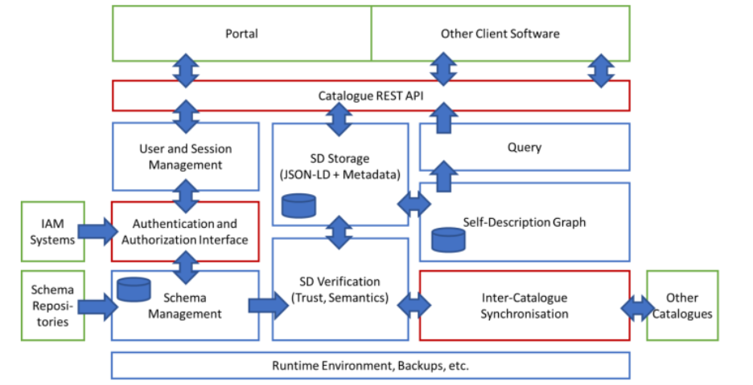
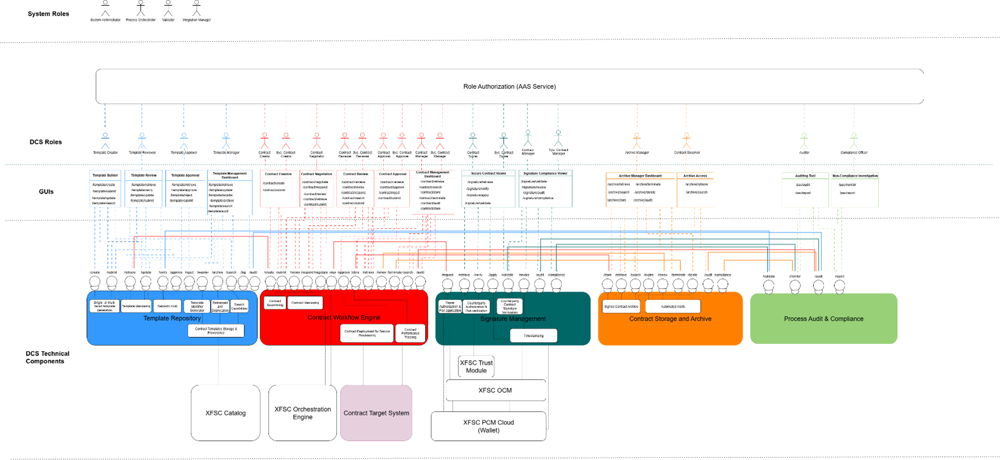

[← Verification](06_verification.md) · [↑ Table of Contents](../README.md)

---

## 7 Appendix

### Appendix A: Glossary

**Access Rights Revocation:** Withdrawing rights when credentials or signatures are revoked; affected items are flagged and require re-signing to restore.

**Audit Log Filtering:** The ability to search and filter audit logs based on specific criteria, such as date range, user, or event type.

**Automated Alerts:** System-generated notifications for key contract events, such as renewals, expirations, or required actions.

**Automated Breach Notification:** A system-triggered alert to relevant parties when a contract-related compliance breach is detected.

**Automated Compliance Checks:** System-driven validation processes that compare contracts against legal, regulatory, or organizational requirements before execution or storage.

**Automated Workflows:** Automates contract generation, execution, and deployment to ensure legal consistency and efficiency.

**Clause Library:** A curated collection of pre-approved contract clauses that can be reused across different templates to ensure legal and operational consistency.

**Compliance Dashboard:** A user interface that provides real-time visibility into the compliance status of contracts, workflows, and related activities.

**Counterparty Authorization:** The verification process ensuring the other contracting party has proper authority to sign on behalf of their organization.

**Counterparty Contract Signature Verification:** The process of confirming the authenticity and integrity of a counterparty’s digital signature.

**Cross-Format Signature Binding:** Ensuring that a signature is valid across multiple contract representations (e.g., machine-readable and human-readable versions).

**Cryptographic Proof of Contract Execution:** A verifiable record containing hashes, timestamps, and signer identity data that confirms a contract was executed as intended.

**Delegated Signing:** The process where an authorized individual signs a contract on behalf of another person or organization based on a verifiable power of attorney or delegation credential.

**Event-Driven Contract Execution:** Progressing execution steps when specified lifecycle events occur. Immutable Storage: A storage system where data, once written, cannot be altered or deleted, ensuring integrity for legal and compliance purposes.

**Linked Signatures:** Digital signatures bound to both machine-readable and human-readable versions of a contract, ensuring content consistency across formats.

**Machine-Readable Contract Template:** A contract template encoded in a structured, machine-processable format such as JSON-LD for interoperability and automation.

**Machine Signing:** Supports automated signing for high-volume or routine transactions.    

**Multi-Contract Signing:** Enables multi-party contract execution within a single integrated workflow.     

**Multi-Factor Signing Authentication:** A signing process that requires more than one authentication factor (e.g., password + biometric) to verify the signer’s identity.  

**Negotiation History:** A record of all changes, comments, and proposals made during the contract negotiation process.     

**Non-Compliance Investigation:** A process for identifying, analyzing, and reporting contract-related violations or missed obligations. 

**Organizational Seal:** A digital seal that ensures the origin and integrity of electronic documents issued by a legal entity.     

**Parallel Signing:** A signing mode where multiple parties can apply their signatures simultaneously rather than sequentially.     

**Regulatory Reporting Export:** A feature that generates reports in standardized formats for submission to regulators or oversight bodies. 

**Remote QES Signing Service:** An external service that enables the remote application of a qualified electronic signature, typically via a secure API. 

**Retention Schedule:** A documented policy specifying how long contracts and related records must be retained before being archived or deleted. 

**Role Assertion:** A verifiable-credential claim of a user’s role (e.g., Template Manager/Approver) presented for authentication and authorization. 

**Role-Based Access Control for Audit Logs:** A permissions model that restricts access to audit logs based on predefined user roles to protect sensitive compliance data. 

**Role-Based Signature Routing:** The automated assignment of signing tasks to the correct parties based on their predefined roles and authority. 

**Secure Contract Viewer:** A protected interface for viewing contract content in a secure, tamper-proof environment before signing, preventing unauthorized changes. 

**Secure Retrieval:** A controlled process for accessing stored contracts that enforces authentication, authorization, and audit logging. 

**Semantic Hub:** A centralized service or repository that provides standardized vocabularies, taxonomies, and ontologies to ensure semantic consistency across contract templates and workflows.

**Signature Management:** The process of linking contract signatures to verifiable digital identities to maintain legal validity and trust.

**Signature Process:** The structured set of steps for applying electronic signatures to a contract, ensuring rolebased compliance and validation.

**Signature Revocation:** The act of invalidating a previously applied electronic signature, typically in cases of compromise, error, or contract withdrawal.

**Signature Verification Service:** A service that checks the validity, authenticity, and integrity of an electronic signature against predefined legal and technical criteria.

**Signed Contract Archive:** A secure repository for finalized contracts, maintained in both machine-readable and human-readable formats to ensure long-term accessibility and integrity.

**Signer Authorization:** The verification process ensuring a person has the authority to sign a contract on their own behalf or for an organization.

**Status List:** A revocation/status registry used to check whether credentials or signatures are valid. 

**Structural Dependency Mapping:** The process of identifying and linking related sections, clauses, or data points within or across contract templates to maintain logical and legal coherence. 

**Tamper-Proof Audit Trail:** An immutable record of all contract-related activities throughout the lifecycle, ensuring that no entries can be altered without detection. 

**Template Identifier Generator:** A generator that assigns globally UUIDs or DIDs to templates, ensuring they are universally identifiable and traceable across contract workflows. 

**Versioned Archive:** An archive that maintains multiple versions of a contract or document, preserving a full historical record of changes. 

**Workflow State Transition:** The change of a contract’s status within the workflow lifecycle, triggered by specific events or actions.

### Appendix B: To Be Determined List

#### TBD-A: Use of Qualified Electronic Seals in Digital Contracts  
Status: Open    
Definition: The legal validity and contractual effect of applying a qualified electronic seal (QSeal) generated with a qualified seal creation device (QSCD) to contractual documents within the [System/Project] workflow has not yet been determined.     

Resolution Criteria:
1. Receipt of written legal advice confirming whether QSeals (as distinct from qualified electronic signatures) are sufficient or complementary for contract formation and/or evidentiary purposes under applicable law, and any constraints on their use.
2. Confirmation of the relevant technical and certification properties of the selected D-Trust electronic seal solution (e.g., qualification status, device protection/QSCD, certificate profile, validation/longterm validation capabilities) and their alignment with the legal advice.

Dependencies: External legal counsel; D-Trust product/technical documentation (see vendor information: dtrust electronic seals)

#### TBD-B: Use of XFSC PCM as Personal Identity Wallet

Status: Open    
Definition: The selection and use of the XFSC Personal Credential Manager (PCM) as the personal identity wallet for natural-person users in DCS (covering authentication, credential presentation, Power-of-Attorney (PoA) chain verification, and signing flows) is not yet finalized. While the SRS foresees integration with identity wallets and explicitly references XFSC’s PCM via the FACIS orchestration layer and EUDI-conformant infrastructures, the actual availability, maturity, and compatibility of PCM for the required DCS use cases remain to be confirmed.

Resolution Criteria:

1. Status & availability report from ECO Verband and XFSC wallet experts: A written statement on current status, roadmap, and deployment availability (demo/test/prod) of XFSC PCM (incl. Cloud PCM) and support/hosting model. Note: the SRS anticipates orchestration that “can be hosted by ECO.”

### Appendix C: JSON-LD Contract Policy Example

This chapter provides a JSON-LD based example of a machine-readable contract policy, illustrating how contractual conditions and obligations can be expressed in a standardized format for validation and enforcement within the Digital Contracting Service. This policy is expressed in the W3C Open Digital Rights Language (ODRL).

[ { "@id": ":b0", "@type": [ "http://www.w3.org/ns/odrl/2/Permission" ], "http://www.w3.org/ns/odrl/2/action": [ { "@id": "http://www.w3.org/ns/odrl/2/use" } ], "http://www.w3.org/ns/odrl/2/assignee": [ { "@id": "https://w3id.org/drk/resource/RegionalNewspaper" }, { "@id": "https://w3id.org/drk/resource/CultureResearchInstitute" } ], "http://www.w3.org/ns/odrl/2/assigner": [ { "@id": "https://w3id.org/drk/resource/DE_Staatstheater_Augsburg" } ], "http://www.w3.org/ns/odrl/2/constraint": [ { "@id": ":b1" }, { "@id": ":b2" } ], "http://www.w3.org/ns/odrl/2/target": [ { "@id": "https://w3id.org/drk/resource/AugsburgStaatstheaterShowtimesAPI" } ] }, { "@id": ":b1", "@type": [ "http://www.w3.org/ns/odrl/2/Constraint" ], "http://www.w3.org/ns/odrl/2/leftOperand": [ { "@id": "http://www.w3.org/ns/odrl/2/spatial" } ], "http://www.w3.org/ns/odrl/2/operator": [ { "@id": "http://www.w3.org/ns/odrl/2/eq" } ], "http://www.w3.org/ns/odrl/2/rightOperand": [ { "@value": "DE" } ] }, { "@id": ":b2", "@type": [ "http://www.w3.org/ns/odrl/2/Constraint" ], "http://www.w3.org/ns/odrl/2/leftOperand": [ { "@id": "http://www.w3.org/ns/odrl/2/dateTime" } ], "http://www.w3.org/ns/odrl/2/operator": [ { "@id": "http://www.w3.org/ns/odrl/2/lteq" } ], "http://www.w3.org/ns/odrl/2/rightOperand": [ { "@type": "http://www.w3.org/2001/XMLSchema#dateTime", "@value": "2025-05-10T23:59:59" } ] }, { "@id": "https://w3id.org/drk/resource/AugsburgStaatstheaterShowtimesAPI", "@type": [

"https://w3id.org/drk/ontology/ShowTimesAPI", "http://www.w3.org/ns/odrl/2/Asset" ], "http://purl.org/dc/terms/title": [ { "@language": "de", "@value": "AugsburgStaatstheaterShowtimesAPI" } ], "http://www.w3.org/ns/odrl/2/hasPolicy": [ { "@id": "https://w3id.org/drk/ontology/TempoSpatialAccess" } ], "http://www.w3.org/ns/odrl/2/uid": [ { "@value": "AugsburgStaatstheaterShowtimesAPI" } ] }, { "@id": "https://w3id.org/drk/resource/CulturalPlatformBavaria", "@type": [ "http://www.w3.org/ns/odrl/2/Party" ], "http://www.w3.org/2000/01/rdfschema#label": [ { "@language": "en", "@value": "Cultural Platform Bavaria" } ], "http://www.w3.org/2004/02/skos/core#definition": [ { "@language": "en", "@value": "Represents a Cultural Platform subscriber" } ], "http://www.w3.org/ns/odrl/2/uid": [ { "@value": "CulturalPlatformBavaria" } ] }, { "@id": "https://w3id.org/drk/resource/CultureResearchInstitute", "@type": [ "http://www.w3.org/ns/odrl/2/Party" ], "http://www.w3.org/2000/01/rdfschema#label": [ { "@language": "en", "@value": "Culture Research Institute" } ], "http://www.w3.org/2004/02/skos/core#definition": [ { "@language": "en", "@value": "Represents a culture research institute subscriber" } ], "http://www.w3.org/ns/odrl/2/uid": [ { "@value": "cultureresearchinstitute" } ] }, { "@id": "https://w3id.org/drk/resource/DE_Staatstheater_Augsburg", "@type": [ "http://www.w3.org/ns/odrl/2/Party", "http://xmlns.com/foaf/0.1/Organization" ], "http://www.w3.org/2000/01/rdfschema#label": [ { "@language": "en", "@value": "DE_Staatstheater_Augsburg" } ], "http://www.w3.org/ns/odrl/2/uid": [ { "@value": "DE_Staatstheater_Augsburg" } ] }, { "@id": "https://w3id.org/drk/resource/RegionalNewspaper", "@type": [ "http://www.w3.org/ns/odrl/2/Party" ], "http://www.w3.org/2000/01/rdfschema#label": [ { "@language": "en", "@value": "Regional Newspaper" } ], "http://www.w3.org/2004/02/skos/core#definition": [ { "@language": "en", "@value": "Represents a regional newspaper subscriber" } ], "http://www.w3.org/ns/odrl/2/uid": [ { "@value": "regionalnewspaper" } ] }, { "@id": "https://w3id.org/drk/resource/TempoSpatialAccess", "@type": [ "http://www.w3.org/ns/odrl/2/Policy" ], "http://www.w3.org/ns/odrl/2/permission": [ { "@id": ":b0" } ], "http://www.w3.org/ns/odrl/2/uid": [ { "@value": "TempoSpatialAccess" } ] } ]

### Appendix D: OCM W-Stack Deployment

The OCM W-Stack Deployment contains several modules for the OID4VC/VP functionality described in the [xfsc-documentation](https://github.com/eclipse-xfsc/docs/tree/main/ocm-w-stack). The deployment scripts are defined in [deployment section](https://github.com/eclipse-xfsc/deployment/tree/main/OCM%20W-Stack) of xfsc. The stack itself splits the protocol in [various parts](https://github.com/eclipse-xfsc/crypto-provider-service): Retrieval, Issuance, Verification and Well Known. Essential crypto parts are defined in the Crypto Provider Service (formerly TSA Signer Service). This service can be used for operations like LDP VC/SD JWT Creation or Verification, creating DID Documents etc. over the [REST API](https://github.com/eclipse-xfsc/crypto-provider-service/blob/main/design/design.go).

### Appendix E: Status Lists

The [status list service](https://github.com/eclipse-xfsc/statuslist-service) implements multiple formats of revocation lists. This service allows it to create a link plus database entry, which can be used for embedding within credentials or other purposes. The service can be deployed standalone or together with the Crypto Provider Service. The list entries can be requested over nats via a small snippet ([golang](https://github.com/eclipse-xfsc/statuslist-service/blob/main/example/main.go), but works in other languages as well)

### Appendix F: Federated Catalogue

<em>Fig.10 – High-level architecture of the XFSC Catalogue</em>

A more detailed overview of the XFSC Federated Catalogue can be found in the Architecture Document: https://gaia-x.gitlab.io/data-infrastructure-federation-services/cat/architecturedocument/architecture/catalogue-architecture.html

### Appendix G: DCS Component Diagram

<em>Fig.11 – DCS component diagram</em>

---

[← Verification](06_verification.md) · [↑ Table of Contents](../README.md)

