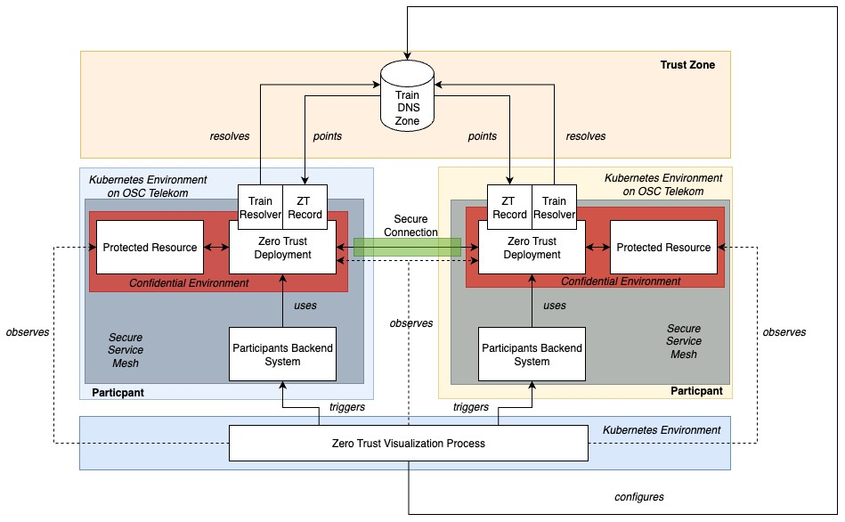
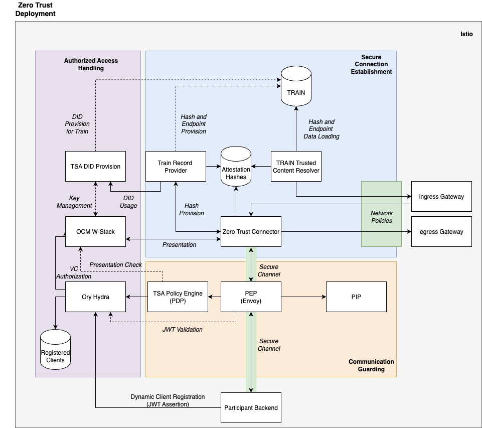
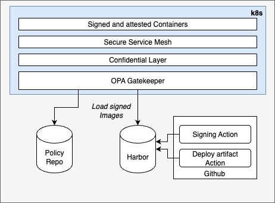
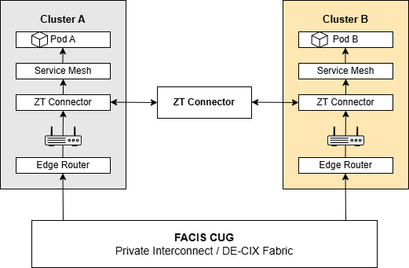

[← Introduction](01_introduction.md) | [↑ Table of Contents](../README.md) | [Requirements →](03_requirements.md)

---

## 2 Product Overview

### 2.1 Product Perspective

The FACIS Zero Trust (ZT) Demonstrator SHALL showcase the interaction between two trust zones as individual federations, which share digital services between entitled participants and principals, based on policy rules. These policy rules define the trust relationship between these two zones, by building a group of loosely coupled actors which interact to each other. To realize this, the Demonstrator SHALL provide a two-party setup/ZT capabilities for establishing trusted connections between for accessing protected resources via a participant backends. Those capabilities can be collected within a ZT deployment which can communicate to other instances of itself for simplifying the ZT process by Trust Framework Manager from communication perspective. This connector SHALL later run within Kubernetes-based ZT service meshes on T-Systems Open Sovereign Cloud (OSC) and IONOS Cloud. TRAIN SHALL complete this by providing all relevant trust information to enable the final Demonstrator to orchestrate a Zero Trust visualization between the two environments. In summary, the ZT Demonstrator can be illustrated as a minimal viable federation of two participants and a ZT governance with TRAIN as federation technology.

<em>Figure 1 Zero Trust Demonstrator Overview</em>

As shown in Figure 1, ZT deployment has a central role within this architecture. In fact, the deployment has a lot of tasks which can be split into the following areas:

- Secure Connection Establishment,
- Communication Guarding,
- Authorized Access Handling for Remote Protected Resources.

Each of those areas SHALL be realized via a set of components and procedures to simplify the usage of ZT principles by providing a Kubernetes deployment. This includes:

- Deployment scripts,
- Signing and attestation procedures,
- Component selection and configuration,
- Adoption pattern for existing backends.

This setup can be visualized as shown in Figure 2.

<em>Figure 2 Zero Trust Setup</em>

The entire setup SHALL be delivered and developed as out-of-the-box solution with a visualization part to demonstrate the working solution to an external audience.

#### 2.2 Product Functions

The Zero Trust Demonstrator MUST provide the following core capabilities:

<em>Table 3 - ZT Demonstrator Core Functions</em>

|Number|Name|Description|
|---|---|---|
|ZT-01|Secure Service Mesh|The secure service mesh SHALL protect communication between all services running for the Demonstrator.|
|ZT-02|Secure Execution Environment|For execution, the product MUST have a protected space within the cluster where the critical components can be securely executed with, signed images and others.|
|ZT-03|Trust Zone|The product SHALL contain a trust zone which features both clusters as “participant”.|
|ZT-04|Secure Connection|Between the ZT Connectors MUST be a secure connection.|
|ZT-05|Communication Visualization|For a better understanding, the product MUST visualize ZT communication via UX, e.g., with animations, etc.|
|ZT-06|Attribute/Credential Based Access Control|ABAC SHALL be applied for the inner communication channel from backend to protected resource,|
|ZT-07|API Dock|The Demonstrator MUST be able to dock APIs as protected resource and as participant backend.|
|ZT-08|Visualization|The Demonstrator MUST have an appropriate visualization of ZT functionality and the user journey behind it.|
|ZT-09|User Journey|The Demonstrator implements a user journey which is orchestrated by [ORCE](https://github.com/eclipse-xfsc/orchestration-engine), and which illustrates how the entire ZT system works.|

### 2.3 Product Constraints

#### 2.3.1 Component Dependencies

The product requires the use of open-source components which are licensed under an Apache 2.0-compatible license.

#### 2.3.2 License

All newly developed components of the Zero Trust Demonstrator MUST be Apache 2.0licensed. Used components MUST have an Eclipse-compatible licensing, e.g., Apache 2.0.

#### 2.3.3 Technology Selection

This subsection defines which core technologies SHOULD be used in development. If there is any abbreviation, e.g., additional or different components required, the abbreviation MUST be declared and aligned with the client.

<em>Table 4 - Technology Selection</em>

|Technology|Constraint|
|---|---|
|Istio|For a secure service mesh, Istio SHOULD be the first choice. Ideally, it SHOULD be applied in ambient mode to reuse the ZT capabilities of Cilium. However, when this is not possible, it MUST be declared how this can be realized with other technologies.  Remark: Running Istio Ambient Mode with Cilium as CNI requires mandatory configuration steps: (1) Cilium MUST be configured with cni.exclusive=false, (2) L7 policies MUST NOT be enforced by both simultaneously to avoid a split-brain problem.|
|OCM W-Stack|OCM W-Stack SHALL be used for CrBAC, credential issuing and credential verification.|
|PCM Cloud|PCM Cloud MAY be used for issuing credentials and as part of the visualization.|
|ORCE|ORCE MUST be used for orchestration purposes|
|Ory Hydra|Ory Hydra offers a headless authorization flow which MAY be extended via Token Hooks to append claims from a presented credential. If other components fit better, Ory Hydra MAY be replaced.|
|Envoy|A proxy implementation is required for the ZT Connector. This MAY require modification/extension of existing components. Envoy in combination with external processors SHOULD be the first choice. If there is any other open-source choice, this MAY be used so long as it fulfills the goal of communication.|

### 2.4 Operating Environment

#### 2.4.1 General

The solution MUST be demonstrated in two cloud environments based on T-Systems OSC and IONOS Cloud to simulate Zero Trust capabilities. Although these environments are provided, the solutions MUST be installed and operated there. Moreover, the operating environment in both cloud providers MUST have the structure as shown in Figure 3.

<em>Figure 3 Basic Infrastructure</em>

#### 2.4.2 Requirements

#### [ZT-10] Image Signing and Attestation
Priority: MUST

Description: All images are currently built and deployed by [GitHub Actions](https://github.com/eclipse-xfsc/dev-ops/blob/main/.github/workflows/dockerbuild.yml) without signing. For a ZT environment, all used components require a signing for providing it properly to OPA Gatekeeper. This requires a workflow which MUST provide a signing for Docker images by using [Cosign](https://github.com/sigstore/cosign) and an attestation flow which is valid for a mock TEE. The flow for the signing and for the attestation MUST be realized via GitHub Actions, but it MUST be ensured that the flows can be triggered by authorized maintainers and committers only. The flows MUST run on a custom GitHub runner which is prepared with key material, Cosign and other attestation tools. If there are other attestation pipelines available, they MAY be used after the client has approved it.

Acceptance Criteria:

- Custom GitHub runner up and running,
- Key material can be uploaded on the runner,
- Runner setup AMD64-based systems.

#### [ZT-11] OPA Gatekeeper
Priority: MUST

Description: The environment MUST start images based on OPA Gatekeeper policies only. In this case, a policy checks if the signature of the images is signed by the client. For this purpose, all relevant key material MUST be distributed via did:web over TSA and linked over TRAIN. The key material MUST be stored in ObenBao as key value entry (if a X509 is used). Otherwise, the keys MUST be used over the transit engine and TSA crypto provider service.

Acceptance Criteria:

- All Docker images signed by the client,
- Gatekeeper blocks unsigned images during pod creation,
- Trust Anchor is provided via did:web,
- Other Governance Rego Policies can be executed over Gatekeeper, e.g., allowed registries, naming conventions or similar.

#### [ZT-12] OPA Policy Repository
Priority: MUST

Description: The OPA Gatekeeper MUST pull its policies from Harbor over OCI. The policy packages MUST be built via GitHub Actions from a private repository to which authorized maintainers and committers have access.

Acceptance Criteria:

- Policy artifacts can be built and uploaded to Harbor,
- Gatekeeper loads and uses the policies from Harbor.

#### [ZT-13] Linux-based Docker Images
Priority: MUST

Description: The solution MUST be developed for Linux-based operation environments and all Docker images MUST be Linux-based.

Acceptance Criteria:

- All Docker images are Linux-based,
- All Docker images up and running.

#### [ZT-14] T-Systems Open Sovereign Cloud Environment
Priority: MUST

Description: The solution MUST be fully operational on the T-Systems [OSC](https://github.com/eclipse-xfsc/osc-devops-docs) environment

Acceptance Criteria:

- Cluster and the solution are reachable.
- All ZT components deployed and in Running state,
- OPA Gatekeeper demonstrably blocking unsigned images,
- End-to-end connection between ZT Connector and protected resource verified.

#### [ZT-15] IONOS Cloud Environment
Priority: MUST

Description: The visualization orchestration for the Demonstrator MUST be operated on the IONOS Cloud.

Acceptance Criteria: Visualization of the Demonstrator runs on the IONOS Cloud.

#### 2.4.3 Connectivity Target Architecture

Within the FACIS Zero Trust framework, two Kubernetes clusters are connected through a so-called Closed User Group (CUG). A CUG is a private, closed network that is exclusively available to defined and authorized participants. The objective is to establish a secure, stable, and controlled connection between two trust zones (federations) without using the public Internet.

This CUG communication concept is independent of all the other zero trust implementations and adds an additional layer of security for IP communication.

#### 2.4.3.1 Technical Principle of the CUG

The CUG is based on two main technical components:

- Layer 2 Virtual Private LAN Service (VPLS)
- Layer 3 Route Reflector architecture

This design follows the IX peering services with quality-of-service monitoring. Global peering enables a customer to exchange IP traffic with many networks connected to the IX via a single BGP session. It is designed to optimize Internet reachability, reduce transit costs, and improve performance by providing scalable, many-to-many connectivity to the global Internet ecosystem.

A CUG, in contrast, is a private, controlled connectivity environment that allows a defined set of participants to communicate exclusively with each other. It is typically used for enterprise, government, or partner networks that require secure, predictable, and isolated communication, independent of public Internet routing.

#### 2.4.3.2 Technical Architecture Layer-2 / Layer-3

The CUG is implemented as a private Layer 3 (IP-based) interconnection service running on the IX network fabric (e.g., DE-CIX Fabric).

This means:

- The connection does not traverse the public Internet.
- No public IP addresses are required.
- Traffic remains within an isolated routing domain (e.g., VLAN or VRF).
- Routing decisions are controlled and managed within the CUG environment.
- The Layer 2 VPLS component provides the private transport domain across the IX fabric, while the Layer 3 Route Reflector ensures scalable and controlled routing between participants.

The CUG therefore provides a secure and deterministic transport layer between locations, forming the foundation for higher-layer services such as encrypted application communication or Zero Trust connectivity.

#### 2.4.3.3 Connectivity Model

The CUG service instance is accessible across the IX network via a CUG Membership based on IX access port.

Participants connect to the IX network via their geographically closest entry point. Connectivity can be achieved through:

- Metro Connect or Cross Connect (if the participant has local data center presence), or
- Third-party Ethernet transport from an on-premises location to the nearest IX site.

#### 2.4.3.4 Architecture for Connecting the Kubernetes Clusters

Each participant operates their own Kubernetes cluster (e.g., IONOS Cloud and T-Systems OSC). The connection is implemented as follows:

- Each cluster includes a dedicated ZT Connector.
- The connector is the only permitted communication endpoint between the clusters.
- The connectors communicate with each other via the private CUG connection.
- Within each cluster, communication is handled through a service mesh (e.g., Istio or Cilium).

<em>Figure 4 Simplified Traffic Flow</em>

#### 2.4.3.5 Benefits of the CUG in FACIS ZT Framework

The CUG provides the following advantages:

- No traffic over the public Internet
- Clearly defined participants
- Deterministic routing
- Support for guaranteed latency
- Scalability for additional federation members
- Alignment with zero trust principles.

#### 2.4.3.6 FACIS CUG Setup Communication Process

Within each FACIS Kubernetes cluster, a ZT Connector acts as the controlled exit and entry point for external communication. When two participants are connected via a CUG, communication does not occur directly from pod to pod. Instead, it always passes through clearly defined transition points.

The process works as follows:
1. An application in Cluster A needs to communicate with an application in Cluster B.
2. The traffic is first handled internally within Cluster A through the service mesh.
3. The traffic is then forwarded to the ZT Connector of Cluster A.
4. The connector sends the traffic to the site’s edge router.
5. The edge router determines, based on its routing table (for example via BGP), that the destination network is reachable through the private CUG.
6. The traffic is transmitted over the dedicated connection toward the IX infrastructure.
7. The IX infrastructure transparently forwards the Ethernet frames to the router of Cluster B.
8. The edge router of Cluster B receives the traffic and forwards it into the internal network.
9. The ZT Connector of Cluster B processes the incoming connection.
10. Only after successful verification (TLS, attestation, policy enforcement) is the traffic forwarded into the internal service mesh.

#### 2.4.3.7 End-to-End Flow of a Single Data Packet

Assume that a single data packet is sent from an application in Cluster A to an application in Cluster B.

The logical path of the packet is as follows:
1. First, the application running inside a pod in Cluster A generates the data packet. The packet leaves the pod and is processed by the Kubernetes networking stack.
2. If the destination is outside the local cluster, the node recognizes that the destination IP address is not local. The packet is therefore forwarded to the node’s default gateway.
3. This default gateway is typically the edge router or a virtual router within the cloud infrastructure.
4. The edge router checks its routing table. It identifies that the destination network of Cluster B is reachable via the private CUG connection.
5. The packet is then forwarded over the dedicated connection toward IX.
6. The router of Cluster B determines that the destination network is locally reachable and forwards the packet into the internal subnet.
7. From there, the packet reaches the Kubernetes node in Cluster B, is processed by the Zero Trust Connector for verification, and is then delivered through the service mesh to the target pod.

The entire physical path is determined by routing tables and BGP decisions and not by Kubernetes itself.

#### 2.5 User Documentation

#### [ZT-16] Cloud Environments
Priority: MUST

Description: The user documentation MUST contain documentation about the operations in both environment and the documentation about the setup. Each documentation MUST be provided in MD file format on GitHub.

Acceptance Criteria:

Documentation can be demonstrated for reproducing the setup of each test cluster stepby-step.

#### [ZT-17] Demonstrator Usage
Priority: MUST

Description: The documentation and usage of the Demonstrator MUST be documented in a way that a manual for the Demonstrator can be generated automatically over GitHub actions.

Acceptance Criteria:

Documentation can be demonstrated for reproducing the setup of each test cluster stepby-step.

#### 2.6 Assumptions and Dependencies

#### 2.6.1 Attestation Code Basis

The Bidirectional Remote Attestation feature relies on the Apache 2.0-licensed CMC aTLS [protocol](https://github.com/Fraunhofer-AISEC/cmc) (see Appendix for implementation reference). If this dependency cannot be fulfilled, an alternative MUST be documented and approved by the client prior to implementation. See Section 3.1.3 for protocol requirements.

#### 2.6.2 Visualization

For the visualization is the assumption that grafana plugins based on Open Telemetry logs can be used to visualize the functionality of the Demonstrator. If this is not the case, another technology MAY be used.

#### 2.7 Apportioning of Requirements

The product SHALL be set up in multiple phases to ensure the integrity of the product's functionality. Each phase SHALL be reflected in the milestone planning of the project plan:

<em>Table 5 - ZT Demonstrator’s Development Phases</em>

|Phase|Target Description|
|---|---|
|Demonstrator UX Concept|- Concept created and aligned with the client - Concept documented on GitHub |
|Cluster Setup|- Two managed clusters in OSC MUST be fully up and running, OPA Gatekeeper + signed image policies, secure service mesh, CI/CD and image signing and attestation pipeline to deploy images. - A third cluster MUST be up and running, including CI/CD on the IONOS Cluster. - DNS Zone for TRAIN is reachable and created. - XFSC Stack is deployed. |
|Zero Trust Connector Development|- Zero Trust Connector deployed in dedicated environment - Connection can be established - Measurement Values are available |
|Zero Trust Visualization|- Protected Resource Mockup(s) up and running - Participant Backend(s) deployed and connected to Zero Trust Connector - Communication between two Clusters is visualized and can be managed via a UI |

---

[← Introduction](01_introduction.md) | [↑ Table of Contents](../README.md) | [Requirements →](03_requirements.md)

