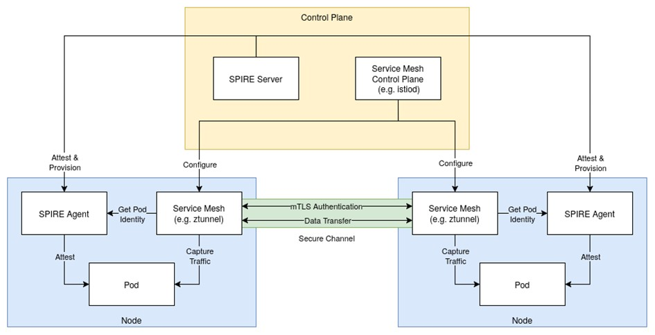
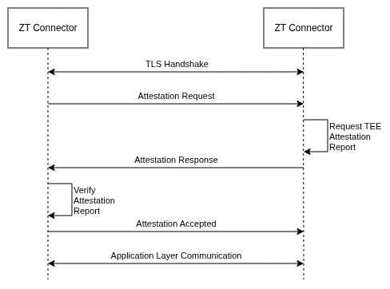
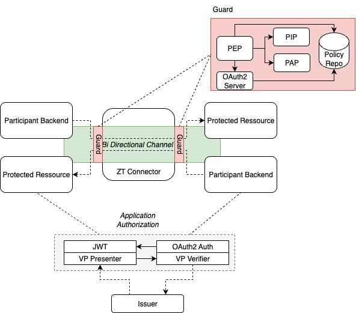
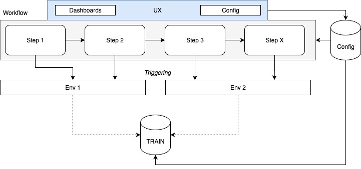

[← Design and Implementation](04_design_and_implementation.md) | [↑ Table of Contents](../README.md) | [Appendix →](06_appendix.md)

---

## 5 System Features

### 5.1 Zero Trust-based Service Mesh

#### 5.1.1 Description

The purpose of the service mesh is to establish trust between the different microservice within a cluster by establishing an identity-based microservice communication. The mesh is based on Cilium or Istio and uses SPIFFE/SPIRE to manage the identities of the microservices. To retrieve an identity, a microservice MUST prove itself against the SPIRE agent. Afterwards, the service mesh ensures that the identity is used for all communications. This enables restricting communications to connections between identities permitted via the configuration and using basic policies to restrict communication within the cluster.

The feature consists of the following functionalities to establish the service mesh: SPIFFE/SPIRE Setup: The feature MUST use SPIFFE/SPIRE to perform basic checks against each microservice and provide it with an identity on success.

Service Mesh: The feature MUST utilize Cilium or Istio to ensure that all communication on the node goes through the identity check and restricts the communication between the microservices to those permitted by the configuration.

#### 5.1.2 Architecture

A typical service mesh consists of a control plane that handles service discovery and configuration, as well as a data plane that forwards data between services within a Kubernetes cluster. Figure 5 provides an exemplary overview of the desired architecture and interactions between the specified components. In case of Istio’s ambient mode, the control plane consists of the [istiod](https://istio.io/latest/blog/2020/istiod/) while the data plane is implemented as one [Ztunnel](https://istio.io/latest/blog/2023/rust-based-ztunnel/) daemon per node. In addition to the service mesh, the use of SPIRE is REQUIRED to assert the identity of each node and pod as well as provision of service mesh certificates for each pod. The service mesh MUST be configured to fetch the certificate on behalf of each pod (e.g., using the SPIRE-delegated identities [API](https://spiffe.io/docs/latest/deploying/spire_agent/)) and use it in mutual TLS authentication for communication in the service mesh.

Data from external sources enters and exits the service mesh through the ZT Connector, thus eliminating the need for an external gateway service supplied by the service mesh. Data entering the service mesh from the ZT Connector MAY be routed to any service within

<em>Figure 5 Architecture Service Mesh and Interaction</em>

the service mesh but MUST pass an additional proxy acting as a policy enforcement point. Interactions between different services are restricted based on network policies that are enforced by the service mesh itself.

#### 5.1.3 Definition of Done

Feature is complete when a pod fetches its identity from a SPIRE Agent and the identity is afterwards used in all communication within the mesh.

<em>Table 6 - Requirements for a Zero Trust-based Service Mesh</em>

|Number|Name|Description|
|---|---|---|
|ZT-57|SPIFFE/SPIRE Setup|SPIFFE/SPIRE is set up and each microservice has access to a SPIRE Agent on the same node.|
|ZT-58|Service Mesh Setup|The service mesh is enabled, and the service mesh control plane is set up. An entity that captures traffic (such as Ztunnel daemon) and uses the pod’s certificate for mutual TLS is available on each node.|
|ZT-59|Successful Identification|The microservice successfully attests itself against the SPIRE Agent and receives an identity.|
|ZT-60|Unsuccessful Identification|The microservice unsuccessfully attests itself against the SPIRE Agent and does not receive an identity. The microservice cannot connect to any other service in the mesh.|
|ZT-61|Traffic routed via Service Mesh|All communication of the microservice is routed via the service mesh.|
|ZT-62|Limited Communication within Mesh|The microservice is only able to communicate with identities permitted in the configuration.|

### 5.2 Bidirectional Remote Attestation

#### 5.2.1 Description

The purpose of the remote attestation is to establish a TLS connection between two ZT Connectors bound on the successful remote attestation of each other. The procedure includes the verification of an attestation report, which among others contains the measurement of the mocked TEE. To be able to verify this measurement, correct measurements are stored in TRAIN in the respective TRAIN Trust Content Resolver (TCR). This allows the verifier to fetch expected measurements for the remote ZT Connector, which it can then match against the measurement received in the attestation report.

To establish this connection, the feature consists of the following functionalities:  

Trusted Environment Setup:   
The setup of a real TEE environment is not REQUIRED, but the attestation file formats MUST be mocked.  

TRAIN Setup:   
The feature MUST utilize a shared TRAIN infrastructure to exchange information between ZT Connectors.   

TLS Setup:   
The feature MUST utilize TLS to ensure the integrity and confidentiality of the exchanged data.

#### 5.2.2 Architecture

REQUIRED is the use of an attestation protocol that is performed after the TLS handshake is completed. Figure 6 shows a high-level representation of the protocol flow for one peer, which is described in more detail below. While no specific protocol is REQUIRED to be used, Appendix includes an example of the usage of an acceptable protocol. This protocol flow MUST be performed by the client and server of the TLS connection to ensure that both peers are attested. As the client’s and server’s protocol flow are independent, they MUST be performed in parallel to avoid high handshake delays. In the following, we will refer to the two peers as initiator and responder.

After the TLS handshake has finished, the initiator begins the protocol flow by sending an attestation request message containing the type of attestation the initiator requests. This can be server-only, client-only or mutual attestation. The responder MUST terminate the protocol with an error if it requires a different type of attestation.

The responder then generates an attestation report using the mocked TEE that contains the TLS-exporter secret associated with the underlying TLS connection. This value MUST be included so that its integrity is ensured by the attestation report, e.g. by including it in the report’s user data field. The responder then sends an attestation response message to the initiator containing that report.

When evaluating the attestation report sent by the responder, the initiator MUST ensure that the correct TLS-exporter secret is contained within and that the mocked TEE’s launch digest matches the expected value found in the responder’s TCR. If this verification fails, the initiator MUST terminate the protocol. If the attestation report is acceptable, the initiator

sends a verification result message to the responder, indicating that the initiator is ready to proceed to the application layer protocol.

||
|---|

<em>Figure 6 Protocol Flow for One Peer</em>

#### 5.2.3 Definition of Done

A feature is complete when two ZT Connectors establish a connection between each other by performing the attested TLS protocol handshake and verifying the information in the received attestation report against the information in the respective TCR.

<em>Table 7 - Requirements for Bidirectional Remote Attestation</em>

|Number|Name|Description|
|---|---|---|
|ZT-63|TEE Mock Setup|The TEE mock setup is enabled and generates Demo Attestations.|
|ZT-64|Expected Measurement Retrieval|A ZT Connector can fetch expected mocked TEEM values from other connectors via TRAIN.|
|ZT-65|Connection Start|ZT Connector 1 starts a connection by sending an attestation request.|
|ZT-66|Remote Attestation|ZT Connector 2 responds to the attestation request by creating an attestation report and sending it to ZT Connector 1.|
|ZT-67|Attestation Report Verification|ZT Connector 1 verifies the attestation report by comparing the expected mocked TEEM against the mocked TEEM values in the TCR.|
|ZT-68|Verification Result|ZT Connector 1 informs ZT Connector 2 about the result of the verification.|
|ZT-69|Established Connection|The handshake was successful, and application layer communication can take place via established connection.|
|ZT-70|Refused Connection|An error occurred during the handshake or verification of the attestation report failed. It MUST be proven that no application layer communication can take place|

### 5.3 Zero Trust Execution Environment

#### 5.3.1 Description

The ZT execution environment feature of the solution SHALL provide a mocked TEE together with secure Kubernetes configurations which is the basis for remote attestation and security relevant actions like authentication and authorization. To establish this, the feature consists of the following functionalities:

Trusted Environment Setup: The feature MUST mock the behavior of a TEE environment by creating simulated attestation reports without any real enclave technology.

Admission Policies: The feature MUST ensure that only verifiable image according to an OPA Policy can be started. For this purpose, the OPA Gatekeeper MUST be used in combination with the TSA Policy Engine and TRAIN.

Signed Harbor Images: To sign the images which are used for the ZT environment, the used Harbor images MUST be signed in a way that the OPA Gatekeeper policies can verify from which source the images were created. For this purpose, the feature MUST provide a Cosign solution for Harbor which can be triggered via GitHub CI to sign a set of images for the ZT Demonstrator.

#### 5.3.2 Architecture

Architecture as described in Chapter 2.4 Operating Environment.

#### 5.3.3 Definition of Done

<em>Table 8 - Requirements for Zero Trust Execution Environment</em>

|Number|Name|Description|
|---|---|---|
|ZT-71|Image Signing and mock Attestation|A defined set of images from Harbor can be defined for ZT environment, can be signed via CI/CD, and the signature is uploaded to harbor. A mock attestation is generated as JSON format for any TEE vendor.|
|ZT-72|Secure Pod Startup|OPA Gatekeeper is configured together with a policy, and the cluster starts only the images which are properly signed.|

### 5.4 Zero Trust Application Communication

#### 5.4.1 Description

The application of communication is the part of the Demonstrator for the usage of the secure channel between participant backend and protected resource over the ZT Connector. Within this communication channel, Zero Trust is enforced on application level and consists of the following parts:

- Credential verification to obtain access tokens of counter ZT Connector,
- JWT-based access to protected resources based on credentials,
- Policy enforcement and policy decision making by ZT Connector guarding,
- Routing of incoming ZT Connector calls together with access credentials to protected resources.

These parts SHALL be combined into a guarding solution which bi-directionally guards the REST/GRPC communication upstream/downstream.

#### 5.4.2 Architecture

<em>Figure 7 Zero Trust Application Communication</em>

The architecture contains on both sides a guard setup with PIP, PEP, PAP, OAuth2 Server and Policies. This setup has the task to verify and authorize incoming requests for their validity, rate limits, and authorization.

#### 5.4.3 Definition of Done

<em>Table 9 - Requirements for Zero Trust Application Communication</em>

|Number|Name|Description|
|---|---|---|
|ZT-73|Authorized Upstreaming over the Zero Trust Connector|The participant backend can authorize and connect the ZT Connector and can successfully call over the trusted channel the protected resource. The protected resource verifies successfully the incoming call according to policies and responds with an answer.|
|ZT-74|Participant Backend Mock|The participant backend mock simulates and participant backend which uses the trusted channel to the protected resource and pushes status data to the visualization.|
|ZT-75|Protected Resource Mock|The protected resource mock simulates a protected resource and reacts on various combinations of access rights. All accesses are visualized in the visualization.|
|ZT-76|Credential Based Access|Based on credentials, the protected resources are returning various responses. All credentials MUST be exchanged beforehand against a JWT token and mapped into any kind of roles.|
|ZT-77|Mock Replaceable|All mocks are replaceable via demonstrating a realworld API.|

### 5.5 Zero Trust Communication Visualization

#### 5.5.1 Description

The Demonstrator SHALL provide a visualization for the Zero Trust activities, which shows, for instance, the measurement values of the connection, IP addresses, used policies or their results. Furthermore, the visualization SHALL allow to manage used policies, manage the TRAIN zone and connect to a second cluster via TRAIN discoveries (Figure 8). The process itself SHALL be visualized as a scenario which demonstrates a user journey. In summary, the workflow of the running Demonstrator setup SHALL be comprehensible to a wider audience with less knowledge about Zero Trust.

#### 5.5.2 Architecture

The architecture for the visualization SHALL be designed as a workflow-driven UI by using ORCE, which demonstrates step-by-step communication and a guided configuration to the user. The entire feature can be understood as presentation UI for the Demonstrator.

<em>Figure 8 Workflow-driven UX</em>

#### 5.5.3 Definition of Done

<em>Table 10 - Requirements for Zero Trust Communication Visualization</em>

|Number|Name|Description|
|---|---|---|
|ZT-78|Visualization UI|A visualization UI presents the core values of Zero Trust, like connection status, measurement values of the mocked TEE, sent messages, blocked messages etc.|
|ZT-79|Visualization Concept|The visualization concept is documented in GitHub and aligned with the client.|
|ZT-80|Zero Trust Configuration|The setup of the Zero Trust can be configured, e.g., protected resources, participant backends, mock replacement, attestation procedures and DNS records.|
|ZT-81|User Journey Scenario|The visualization demonstrates a user journey scenario orchestrated via ORCE. The scenario is aligned with the client and explained in documentation and visualization step by step.|

---

[← Design and Implementation](04_design_and_implementation.md) | [↑ Table of Contents](../README.md) | [Appendix →](06_appendix.md)

