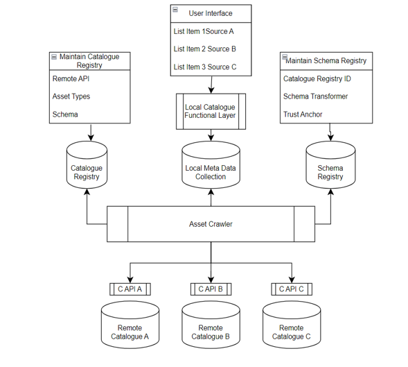

[← Scope & Boundaries](03_scope_boundaries.md) · [↑ Table of Contents](../README.md) · [Functional Requirements →](05_functional_requirements.md)

---

## 4. Conceptual Architecture

This system provides a unified architecture to search, aggregate, and present metadata from multiple distributed service catalogues. It supports interoperable service listings, metadata exchange, and integration with lifecycle and security management systems. The system aims to enable secure, cross-domain access to catalogue data while maintaining separation of concerns between data retrieval and data management.

<em>Figure 1 FAP DCM: Architecture Overview</em>

### FAP Components

- **Local Catalogue Functional Layer and User Interface (UI)**

    -  Responsible for managing local metadata collection.
    -  Facilitates user interactions including search and retrieval.
    -  Presents unified catalogue views combining multiple sources.

- **Catalogue Registry and UI**
    -  Maintains metadata for remote catalogue services.
    -  Stores key attributes such as API endpoints, trust anchors, schema types, and supported query languages.
    -  Provides UIs for managing catalogue entries.

- **Schema Registry and UI**
    -  Maintains a model of the remote catalogues, from the perspective of the local catalogue: what we expect to find in remote catalogues, continuously updated according to what we found there.
    -  Maintains mappings between local schema and remote schemas for each catalogue entity.
    -  Stores trust anchors and schema transformers.
    -  Provides administrative UI for managing schema relationships.

- **Asset Crawler**
    -  On-demand crawler harvesting remote assets via catalogue APIs.
    -  Transforms remote metadata into local schema representation using mappings.
    -  Stores transformed metadata into the local meta data collection for efficient querying.
    -  Provides administrative UI for initiating a harvest. This should enable the user to set the following parameters:
        -  Remote Catalogue ID(s)
        -  Query
        -  Schema mapper

### Key Components

- **XFSC Services**  
    - **CAT (Catalogue)** – local data container for services and assets. 
    - **ORCE** – orchestration hooks for resource lifecycle. 
    - **AAS** – authentication and authorization service.

- **Data Flow**
    1. Users interact with the UI to perform unified searches or browse catalogue items.
    2. The Local Catalogue Functional Layer processes these requests, querying the Local Meta Data Collection.
    3. The Asset Crawler retrieves metadata from remote catalogues via respective APIs (C API A, B, C), transforming and updating the local metadata store.
    4. The crawler interacts with the Catalogue Registry and Schema Registry to ensure data consistency, proper schema transformation, and validation against trust anchors.
    5. Administrators manage catalogue and schema registries through their respective UIs.

- **Interfaces & Protocols**
    -  **Remote APIs:** Communication with remote catalogues via defined APIs, typically RESTful or SOAP endpoints (e.g., API A, B, C).
    -  **Internal APIs:** For interactions between the Asset Crawler, Local Catalogue Functional Layer, Catalogue Registry, and Schema Registry.
    -  **User Interface API:** Supports querying and retrieval of metadata.

- **Schema and Data Models**
    -  **Catalogue Entries:** Metadata structure representing service listings from remote catalogues.
    -  **Local Meta Data Collection:** Stores transformed metadata in a unified local schema.
    -  **Schema Mapping:** Defines relationships between local and remote schema attributes.
    -  **Trust Anchors:** Security elements to verify claims and ensure data authenticity. In line with CAT-FR-CO-03 of the Federated Catalogue Enhancement specification, the actual verification is performed by external services [FACIS.FCE.SRS].
    -  Schema Transformers: Logic for converting remote metadata formats into local schema formats.

- **Security Considerations**
    -  **ICAM Integration:** Ensures secure authentication and authorization for accessing services and catalogues.
    -  **Trust Anchors:** Used in Schema Registry for verifying service listing claims and metadata integrity.
    -  **Secure API Access:** Remote API connections secured using tokens, certificates, or other authentication mechanisms.

- **Data Validation**
 Enforced at schema transformation stage to prevent invalid or malicious data.

- **Error Handling and Logging**

    -  **Asset Crawler:** Implements retry logic and error logging for failures during remote crawling.
    -  **Validation Errors:** Logged and reported for schema mismatches or security violations.

- **UI**  
 Presents meaningful error messages for data retrieval failures.

- **Deployment and Maintenance**
    -  **Catalogue Registry & Schema Registry:** Interfaces available for administrators to maintain remote catalogue definitions and schema mappings.
    -  **Asset Crawler:** Runs on demand or on schedule to ensure up-to-date metadata.
    -  **User Interface:** Updated regularly to support new catalogues or schema changes without disrupting user experience.

---

[← Scope & Boundaries](03_scope_boundaries.md) · [↑ Table of Contents](../README.md) · [Functional Requirements →](05_functional_requirements.md)

