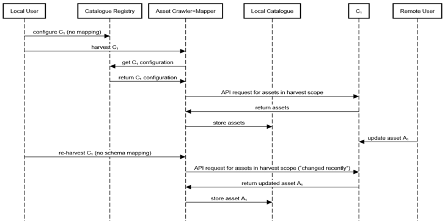
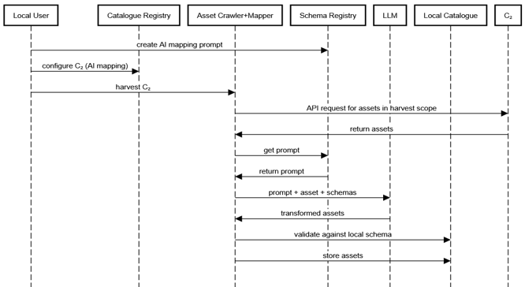

[← Functional Requirements](05_functional_requirements.md) · [↑ Table of Contents](../README.md) · [Security & Trust →](07_security_trust.md)

---

## 6. Technical Architecture

### 6.1 Flows of Interaction with the Components

The following UML sequence diagrams show two typical flows of interaction with the components of the DCM FAP:

- Figure 2 shows the harvest of a remote catalogue without mapping. After the update of an asset in the remote catalogue, it is harvested once more.
- Figure 3 shows the harvest of a remote catalogue with AI-driven mapping of the harvested assets into the target schema of the local catalogue.

<em>Figure 2 Harvest and Re-harvest without Mapping</em>

<em>Figure 3 Harvest with AI-driven Mapping</em>

### 6.2 ORCE Integration Requirements

This FAP MUST be implemented on top of the XFSC Orchestration Engine. ORCE provides the workflow runtime, UI generation layer, and integration capabilities required for configuring catalogue sources, executing harvest operations, managing schema transformations, and supporting administrative controls.

ORCE serves as the execution environment for all user facing and automated logic of the FAP DCM. The implementation MUST follow the principles described below.

#### 6.2.1 UI Generation with ORCE UI Builder

All user interfaces of the FAP DCM MUST be created using the ORCE UI Builder technology.

The UI Builder generates dynamic UIs based on ORCE flows and supports the use of modern frontend frameworks such as Vue.js and compatible UI component libraries. The following UIs MUST be implemented using ORCE UI Builder:

- Schema Registry UI
- Catalogue Registry UI
- Asset Crawler + Mapper UI
- Prompt Management UI
- Prompt Testing Interface
- Administrative UI, including user and role management
- Monitoring pages

Using the UI Builder ensures consistency with other FACIS components and avoids manual HTML based UI creation where ORCE already provides structured rendering capabilities.

#### 6.2.2 Use of ORCE Standard Components

Where ORCE provides standard nodes or UI components for a specific interaction pattern, these MUST be used. Examples include:

- Multi step wizards
- Standard form layouts
- Record tables with pagination
- Editor panels
- Action buttons connected to flows
- Validation and error elements

Whenever a UI matches an existing component type supported by ORCE, the implementation MUST rely on those built in components for consistency and maintainability.

#### 6.2.3 UI Structures Without Available ORCE Components

If a required interface does not have a corresponding ORCE component, the implementation MUST follow the structural and interaction guidelines defined in the Reference FAP.

This includes:

- Layout structure
- Header and metadata placement
- Form grouping conventions
- Standard validation patterns
- Interaction flow patterns

#### 6.2.4 Workflow Orchestration Using ORCE  
All operational processes of FAP DCM MUST be implemented as ORCE flows. This includes:

- Harvest initiation
- Execution of schema transformations, including the recording of transformation audit trails
- Lifecycle processing for imported assets
- Schema validation and prompt testing
- Re-transformation workflows
- Configuration CRUD operations
- Access control operations defined in FR-AC-01

#### 6.2.5 Integration Requirements  
The FAP MUST integrate with ORCE as follows:

- ORCE flows invoking REST endpoints exposed by FAP DCM components
- User interfaces triggering ORCE actions through UI Builder
- Background processes executed through ORCE flows
- ORCE based access control enforcing roles defined in FR-AC-01
- Workflow status and logs managed through ORCE runtime features

---

[← Functional Requirements](05_functional_requirements.md) · [↑ Table of Contents](../README.md) · [Security & Trust →](07_security_trust.md)

