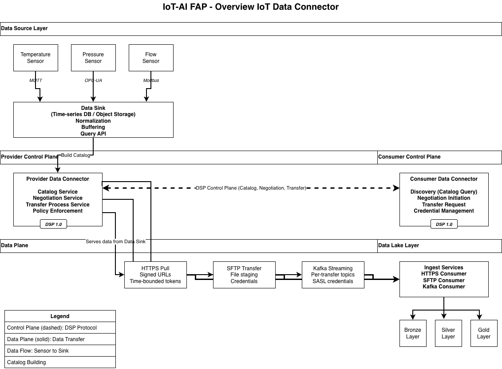
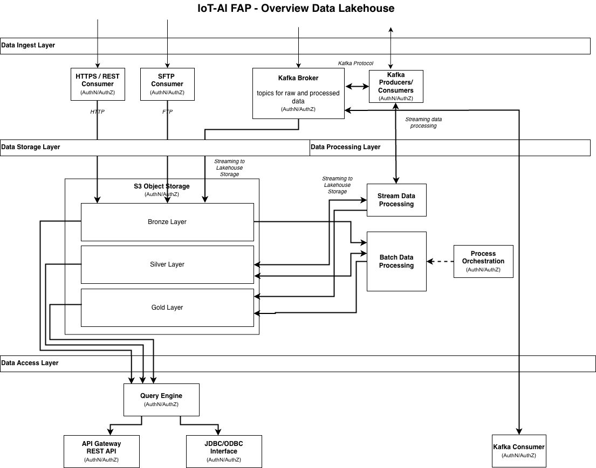

[← Scope](03_scope.md) | [↑ Table of Contents](../README.md) | [Functional Requirements →](05_functional_requirements.md)

---

## 4. Conceptual Architecture

The system follows a federated architecture with clear separation between data collection (IoT sensors, protocols, Data Sink), control plane (DSP for discovery/negotiation/coordination), data plane (actual data transfer via HTTPS/SFTP/Kafka), and data consumption (data lake ingestion). The architecture spans IoT/OT, Enterprise IT, and

Cloud trust zones, with dataspace connectors mediating secure data exchange through the Eclipse Dataspace Protocol.

<em>Figure 2 Overview IoT Data Connector</em>

The conceptual architecture of the data lake follows a typical data lakehouse architecture and supports as well streaming (Kafka) as batch (HTTPS / SFTP) data ingestion and processing.

<em>Figure 3 Overview Data Lakehouse</em>

### 4.1 Trust Zones

#### 4.1.1 IoT/OT Zone

Operational technology environment with sensors, PLCs, and field devices. IoT sensors connect via MQTT, OPC-UA, Modbus, or HTTP protocols to a centralized Data Sink. The Data Sink normalizes incoming data, buffers for reliability, and provides queryable APIs. The Provider DSP Connector reads from the Data Sink to build the dataset catalogue and exposes DSP control plane endpoints (catalogue, negotiation, transfer services).

#### 4.1.2 Enterprise IT Zone

Corporate network hosting enterprise applications, dashboards, and business logic. Dataspace Protocol based data connector can act as both consumer (pulling from edge) and provider (exposing curated datasets). Identity Hub manages organizational credentials.

#### 4.1.3 Cloud Zone

Cloud-hosted data platform with data lake, analytics services, and AI/ML capabilities. Consumer DSP Connector performs discovery (queries provider catalogue), negotiates contracts using DSP protocol, and requests data transfers. After receiving data plane access credentials from the provider, the Consumer coordinates Data Lake Ingest Services which consume data via HTTPS pull, SFTP file transfer, or Kafka streaming (separate from the DSP

control plane). Ingest services land data to bronze layer, with Governance services tagging, cataloguing, and enforcing retention policies.

### 4.2 Key Components

<em>Table 1 Key Components for FAP IoT & AI</em>

|Component|Responsibility|
|---|---|
|IoT Data Collection|Sensor data normalization, buffering, windowing, aggregation|
|OT/IoT Connector|Protocol adapters (OPC UA, MQTT, Modbus), bridge to HTTP/Kafka|
|DSP Connector|Control plane (catalog, negotiation, transfer), policy enforcement|
|DSP Connector Data Plane|HTTP API (signed URLs), Kafka topics (SASL/mTLS credentials)|
|Identity Hub|Store/verify Verifiable Credentials, Decentralized Claims Protocol presentation/verification|
|Policy Agent|Enforce rate limits, purpose restrictions, time-bounded access|
|Data Lakehouse Ingest|HTTP validator, Kafka consumers, schema registry, Bronze/Silver/Gold Batch Ingest SFTP, HTTPS|
|Data Lakehouse Storage|S3 Object Storage, Columnar file storage format (Parquet, ORC); ACID transactions, schema evolution, time travel, Apache (Iceberg), Medallion architecture data design pattern for organizing data|
|Data Lakehouse data processing|ETL/ELT processes, batch and near real time, batch process orchestration|
|Data Lakehouse data access|SQL query engine, JDBC/ODBC interfaces, REST Interfaces|
|Governance|Authentication, Authorization, RBAC/ABAC, Access policies|
|LLM Inference Service|API calls to OpenAI-compatible service (e.g., IONOS AI Model Hub) for generative processing and API Exposure for Output|

---

[← Scope](03_scope.md) | [↑ Table of Contents](../README.md) | [Functional Requirements →](05_functional_requirements.md)
