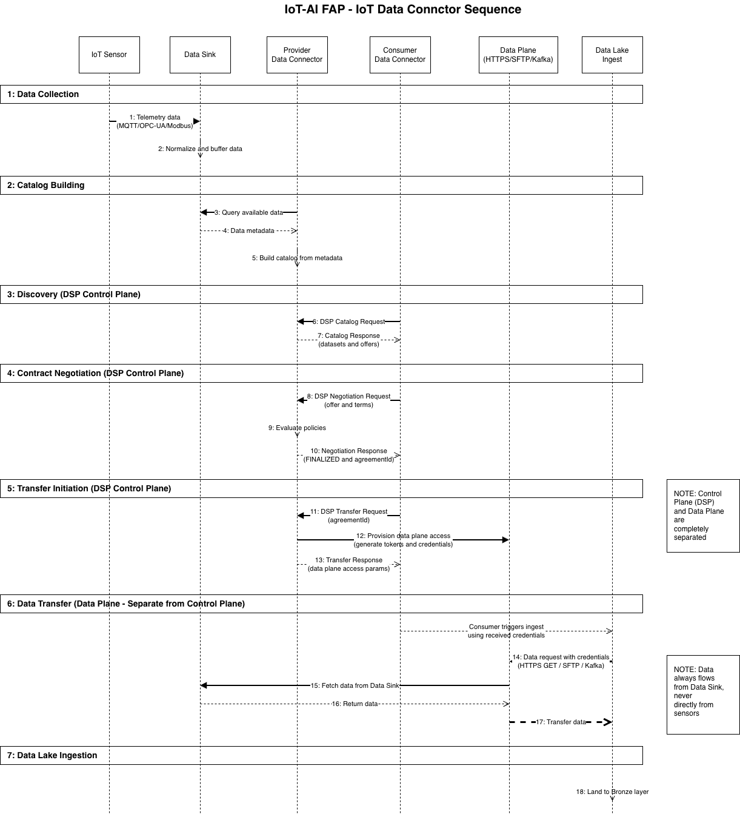

[← Functional Requirements](05_functional_requirements.md) | [↑ Table of Contents](../README.md) | [Interfaces & Data Models →](07_interfaces_data_models.md)

---

## 6. Technical Architecture

<em>Figure 4 IoT Data Connector Sequence</em>

### 6.1 Control Plane Architecture

The DSP control plane follows a microservices architecture with clear separation of concerns. The Provider Data Connector exposes three main DSP services:

(1) Catalogue Service – builds and exposes dataset catalogue from Data Sink,

 (2) Negotiation Service – handles contract negotiation with policy evaluation,

(3) Transfer Process Service – coordinates transfer initiation and provisions data plane access credentials.

The Consumer Data Connector implements corresponding client services for discovery, negotiation, and transfer requests.

CRITICAL: The control plane NEVER transfers data – it only coordinates access and authorization.

<em>Table 2 FAP IoT & AI Service Implementation</em>

|Service|Implementation (exemplary)|
|---|---|
|Catalogue Service|FastAPI REST endpoint with PostgreSQL backend, Redis cache|
|Negotiation Service|State machine with PostgreSQL persistence, async callbacks via webhook|
|Transfer Service|Orchestrates data plane provisioning, stores access params in PostgreSQL|
|Policy Agent|OPA (Open Policy Agent) for policy evaluation and enforcement|
|Identity Hub|Verifiable Credential storage with DCP verification endpoints|

The implementation of the control plane is not in scope but must be prepared to be included.

### 6.2 Data Plane Architecture
#### 6.2.1 HTTP Pull Data Plane

**Components**:

- URL Signer Service: Generates HMAC-signed URLs with embedded expiry and scope
- Data API: FastAPI endpoint serving IoT data with time window filters
- Rate Limiter: Redis-backed token bucket per agreement
6.2.2 Streaming Data Plane Components:

- Kafka Cluster: Distributed log with SASL SCRAM authentication
- Topic Manager: Creates per-transfer topics with retention and ACLs
- SCRAM Provisioner: Generates short-lived credentials and cleans up on expiry
- Schema Registry: Validates message schemas and enforces compatibility

### 6.3 Data Lake Architecture
#### 6.3.1 Ingest Layer

- HTTP Ingest: Service validating tokens and fetching from signed URLs Apache NiFi (Low Code), REST Service, Trino
- Kafka Consumer: Reading from Kafka topic and store in Bronze layer Spark structured streaming, Flink to Parquet file format
- Schema Validation: Enforces data contracts and rejects malformed data
- SFTP file transfer, Apache NiFi (Low Code), Trino

#### 6.3.2 Storage Layer

- Bronze: S3 object storage (e.g. MinIO, Garage, CephFS) with Hive partitioning (agreement_id, year, month, day, hour, ...)
- Silver: Delta Lake / Iceberg tables with data quality rules and deduplication
- Gold: Curated aggregates materialized as views or tables

#### 6.3.3 Data Processing Layer

- Batch data processing low code: Apache NiFi
- Realtime data processing low code: Apache NiFi
- Orchestration: Apache Airflow
- Apache Spark for large scale data analytics, (Pyspark, Java, Scala)

#### 6.3.4 Data Access Layer

- Data retrieval from S3 storage: SQL query engine: Trino
- Interface for SQL-tools JDBC / ODBC
- Interface for REST protocol: API-Gateway (Apache Apisix)

#### 6.3.5 Governance Layer

- Policy Engine for data access, and fine-grained access control (RBAC/ABAC) and auditing:

    -  Open Policy Agent (OPA)
    - Alternative: Apache Ranger for fine-grained access control

- Retention Manager: Enforces agreement-based TTL and deletion (e.g. implemented as batch data pipeline)

### 6.4 AI Processing Architecture

The AI processing layer SHALL be implemented as an orchestration service that retrieves data from the data lakehouse, formats it into prompts, invokes LLM inference via an OpenAIcompatible API, and exposes outputs via a RESTful API. This layer MAY support polling, eventdriven triggers (e.g., via webhooks on data changes), or streaming integration to enable nearreal-time enrichment. Security and governance SHALL align with Sections 9 and FR-DL-005 (e.g., anonymizing sensitive data in prompts).

---

[← Functional Requirements](05_functional_requirements.md) | [↑ Table of Contents](../README.md) | [Interfaces & Data Models →](07_interfaces_data_models.md)
