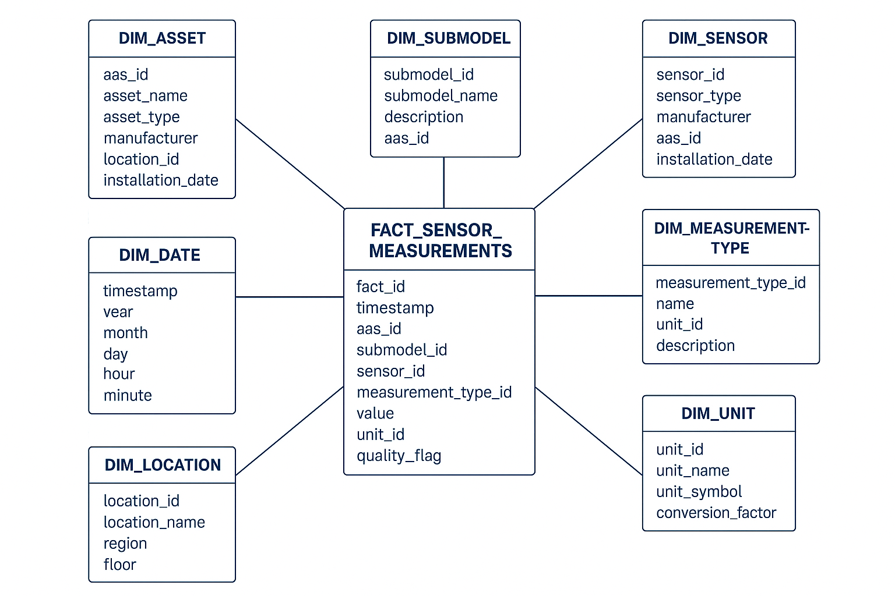

[← Technical Architecture](06_technical_architecture.md) | [↑ Table of Contents](../README.md) | [Security & Trust →](08_security_trust.md)

---

## 7. Interfaces & Data Models

### 7.1 DSP Control Plane Interfaces
#### 7.1.1 Catalogue Request

**Endpoint:** POST /dsp/catalog/request  
**Request Body:** { "providerId": "did:web:provider.example", "filter": { "assetType": "iot.timeseries" }, "page": { "limit": 50, "cursor": null } }   
**Response (200 OK):** { "datasets": [ { "id": "dataset:temp-01", "metadata": {...}, "offers": [ { "id": "offer:temp01:read", "policySummary": {...} } ] } ], "nextCursor": null }

#### 7.1.2 Contract Negotiation

**Open Negotiation:** POST /dsp/negotiations
{ "counterparty": "did:web:provider.example", "offerId": "offer:temp-01:read", "callbackAddress": "https://consumer.example/callback", "proposedTerms": { "purpose": "analytics", "duration": "PT2H" } }  
**Response (202 Accepted):** { "negotiationId": "neg-123" }  
**Get State:** GET /dsp/negotiations/neg-123 { "id": "neg-123", "state": "FINALIZED", "agreementId": "agr-789" }

#### 7.1.3 Transfer Process

**Start Transfer:** POST /dsp/transfers
{ "agreementId": "agr-789", "assetId": "dataset:temp-01", "format": "http-pull", "parameters": { "windowFrom": "2025-10-01T00:00:00Z", "windowTo": "2025-1001T01:00:00Z" } }

**Response (202 Accepted):** { "transferId": "tp-456" }  

**Get Access:** GET /dsp/transfers/tp-456
{ "id": "tp-456", "state": "COMPLETED", "access": { "url": "https://provider.example/api/data/temp-01?from=...&to=...", "token": "eyJ...", "expiresAt": "2025-10-01T03:00:00Z" } }

### 7.2 Data Plane Interfaces

#### 7.2.1 HTTP Pull Access

GET https://provider.example/api/data/{assetId}?from={ts}&to={ts}&sig={hmac} Authorization: Bearer {token}  
Response: JSON array of sensor readings

#### 7.2.2 Streaming Access

**Connection Parameters:**  
{ "bootstrap": "kafka.provider.example:9092", "topic": "iot.dataset.temp-01.tp-456", "sasl": { "mechanism": "SCRAM-SHA-256", "username": "user_tp_456", "password": "..." }, "expiresAt": "2025-10-01T03:00:00Z" }

### 7.3 Data Lakehouse interfaces
#### 7.3.1 Data Lakehouse ingestion interfaces

- Kafka consumer
- REST interface
- SFTP interface

#### 7.3.2 Data Lakehouse access interfaces

- SQL interface (JDBC)
- REST interface
- Kafka consumer

### 7.4 Data Models

<em>Table 3 IoT Entities Key Attributes (1)</em>

|Entity|Key Attributes|
|---|---|
|Participant|id (DID), name, endpoints, credentials[], roles[]|
|Dataset|id, metadata{}, schema_ref, retention_days, data_planes[]|
|Offer|id, dataset_id, policy{purpose, rate_limit, ttl, restrictions[]}|
|Negotiation|id, state, offer_id, consumer_id, provider_id, callback_address, history[], created_at, updated_at|
|Agreement|id, negotiation_id, terms{}, start_time, end_time, signed_at|
|Transfer|id, state, agreement_id, asset_id, format, parameters{}, access{}, created_at, expires_at|
|AI-Output|id, input_data, llm_model, output_text, timestamp|  

<em>Table 4 IoT Entities Key Attributes (2)</em>

|Entity|Key Attributes|
|---|---|
|Sensor Measurement|fact_id, timestamp, asset_id, submodel_id, sensor_id state, offer_id, consumer_id, provider_id, callback_address, history[], cre|
|Agreement|id, negotiation_id, terms{}, start_time, end_time, signed_at|
|Transfer|id, state, agreement_id, asset_id, format, parameters{}, access{}, created_at, expires_at|
|AI-Output|id, input_data, llm_model, output_text, timestamp|

### 7.5 Data Model Guidelines for the Data Lakehouse

The specific data modeling depends heavily on the individual use case. Nevertheless, there are some key design patterns for data modelling for a data lakehouse, which are listed below.

#### 7.5.1 Follow the Medallion Architecture

This layered pattern (Bronze → Silver → Gold) is fundamental for organizing and modeling data in a lakehouse. Each layer builds trust and quality, creating a natural modeling progression from raw → refined → consumable.

<em>Table 5 Data Layers in FAP IoT & AI</em>

|Layer|Pupose|Data Type|Modeling Focus|
|---|---|---|---|
|Bronze|Raw data ingestion|Unstructured, streaming, IoT|Schema discovery, metadata capture|
|Silver|Cleaned, standardized, enriched data|Structured & semistructured|Conformed schema, keys, relationships|
|Gold|Curated, businessready data|Analytical / aggregated|Dimensional models, KPIs, subject areas|

#### 7.5.2 Evolutionary Schema Design

- Lakehouses must handle dynamic, evolving data. This allows your model to stay stable even as data sources change over time.
- Use schema evolution features (supported in Delta Lake, Apache Iceberg, Hudi)

#### 7.5.3 Dimensional Modeling for Analytical Layers

Even though data lakes are flexible, dimensional modeling (Kimball-style) remains powerful for analytics and BI. This pattern enables intuitive, performant dashboards and consistent KPIs.

- Use fact tables (transactions, sensor events, measurements)
- Use dimension tables (assets, time, location, customers)
- Create star or snowflake schemas in the Gold layer
- Apply surrogate keys to stabilize joins
- Store data in open formats (Parquet, Delta) for high-performance queries

<em>Figure 5 Star Schema for Sensor Measurements (Example)</em>

#### 7.5.4 Time-Series and IoT Data

Time-based modelling is essential in IoT and industrial lakehouses and optimizes performance for large-scale sensor data.

- Partition data by time intervals (e.g., daily/hourly folders) for efficient queries
- Use append-only design for streaming data (no in-place updates)
- Apply downsampling or summarization in the Silver or Gold layers (e.g., 1s → 1min → 1h)
- Keep metadata like device_id, timestamp, and status normalized
- Use windowing functions for time-based aggregations (Spark/Flink)

#### 7.5.5 Physical Layout and Partitioning

Because lakehouse data lives on object storage, physical modeling matters. This pattern helps to balance storage cost, query speed and maintainability.

- Partition by high-cardinality fields like date, region, or device type
- Use Z-ordering / clustering (in Delta) or partition pruning (in Iceberg) for query efficiency
- Avoid over-partitioning (too many small files) — use compaction jobs
- Store data in columnar formats (Parquet) for analytics workloads

#### 7.5.6 Multi-Modal Data Access

The data model must support multiple access pattern. Logical views or APIs tailored to different use cases, avoiding data duplication if possible

- SQL interface (JDBC)
- REST interface
- Access to aggregates and KPIs (Star schemas, Gaold Layer)
- Access to feature-level data (Denormalized views, Silver Layer)
- Access for Operational Systems (Stream processing, materialized views)

### 7.6 AI Processing Interfaces

- Data Lake Query: GET /api/data/{layer}/{assetId}?from={ts}&to={ts} (per FR-DL-006).
- LLM API: POST {configurable_base_url}/v1/chat/completions (e.g., https://api.ionos.com/inference-openai) Body: { "model": "llama-2-7b-chat", "messages": [{"role": "user", "content": "Summarize: [data]"}] } Response: { "choices": [{"message": {"content": "output"}}] }
- LLM Output API: GET /api/ai/outputs/{id} for JSON outputs;"

---

[← Technical Architecture](06_technical_architecture.md) | [↑ Table of Contents](../README.md) | [Security & Trust →](08_security_trust.md)
