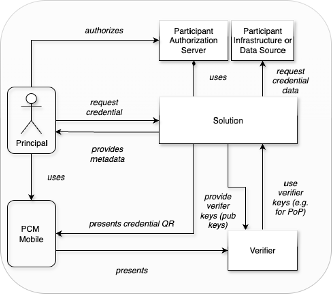

[← Executive Summary](01_executive_summary.md) · [↑ Table of Contents](../README.md) · [Scope →](03_scope.md)

---

## 2. Background & Context

In the self-sovereign identity (SSI) ecosystem, verifiable credentials (VCs) are a fundamental component of every proof. However, the issuance of credentials involves a set of complex and interdependent activities that must be addressed to enable secure, compliant, and scalable usage. In particular, the following challenges must be resolved prior to effective credential issuance:

- Definition and management of credential schemas,
- Maintenance of issuer metadata (e.g. OIDC configuration, cryptographic keys, branding assets),
- Establishment of standardized issuance flows,
- Traceability of credential issuance and lifecycle history,
- Management of credential revocation mechanisms,
- Reliable identification and binding of credentials to their holders,
- Compliance with applicable trust frameworks and regulatory requirements (e.g. eIDAS 2.0).

When addressed in isolation, these functional requirements must be re-implemented for each individual use case, resulting in increased complexity and reduced consistency across an organization. The solution defined in this specification shall address this gap by providing a standardized and scalable credential issuance framework that can be applied across multiple use cases and organizational contexts. Contextually, the solution shall operate within the following business environment:

<em>Figure 1 Solution Context</em>

---

[← Executive Summary](01_executive_summary.md) · [↑ Table of Contents](../README.md) · [Scope →](03_scope.md)

