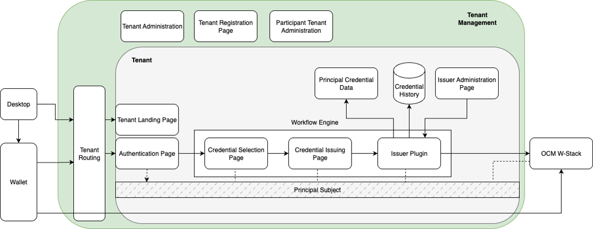

[← Scope](03_scope.md) · [↑ Table of Contents](../README.md) · [Technical Architecture →](05_technical_architecture.md)

---

## 4. Conceptual Architecture

The conceptual architecture of the solution comprises authentication, credential issuance flow orchestration, and the credential issuance service itself. The credential issuance flow shall be orchestrated by ORCE, which manages all steps between authorization and issuance. ORCE shall support tenant-specific and issuer-specific variations of the issuance process. The solution shall enable configurable issuance scenarios, including single-credential and multiple-credential issuance, as well as optional intermediate steps such as forms, questionnaires, or additional validation procedures. These variations shall be implemented through appropriate ORCE nodes. An issuer plugin shall complement the orchestration layer by providing issuer metadata, signing integration, and issuer administration capabilities. The issuer administration page and authentication page shall be provided as static pages that support per-tenant customization, including branding elements such as logos and style configurations. During tenant registration, the solution shall allow configuration of the authentication server, TLS settings for principal data endpoints, and branding customization prior to deployment.

<em>Figure 2 Conceptual Architecture Overview</em>

The entire architectural flow shall be bound to the principal subject, which uniquely identifies the principal within the participant systems. This binding enables the use of a participant-issued token in an end-to-end manner for external API access and for retrieval of credential data. The operational flow of the solution shall be as follows:
1. A participant (organization administrator) shall register via the registration page by submitting required contact and organizational data.
2. Upon confirmation by the tenant administration, the tenant participant shall be activated via an email confirmation mechanism.
3. The participant shall be able to register a passkey for authentication within the tenant administration interface.
4. The participant shall be able to configure tenant-specific settings, including OIDC information, branding elements (logos and stylesheets) and TLS certificates for backend authentication. After that, claims with page administration and issuing rights for various credential types shall be configurable.
5. The participant shall configure the ORCE issuance flow to be deployed. A standard default flow shall be provided by the solution.
6. Upon completion of tenant configuration, the ORCE shall deploy the configured flow, including custom pages, integration of an issuer plugin, and issuer metadata.
7. The issuer flow pages and the tenant-specific issuer administration interface shall become accessible. Credential types shall be configurable within the tenant environment.
8. The issuer flow shall be triggerable through an authenticated login process.

The detailed credential issuance flow shall be implemented as follows:
1. The principal shall access the issuer page.
2. The principal shall authenticate via the OIDC login page configured by the participant.
3. If multiple credential types are available, a credential selection interface shall be presented.
4. The principal shall proceed through the ORCE-based flow configured by the issuer.
5. Upon successful completion of the flow, a QR code shall be generated and displayed.
6. The principal shall scan the QR code using a compatible wallet.
7. The wallet shall communicate with the OCM W-Stack.
8. OCM W-Stack shall invoke the issuer plugin.
9. The issuer plugin shall request required credential data from the participant backend system.
10. The issuer plugin shall return the credential data and corresponding signature and shall register the issued credential for [revocation](https://github.com/eclipse-xfsc/statuslist-service) management and audit history.
11. OCM W-Stack shall transmit the issued credential to the wallet.

---

[← Scope](03_scope.md) · [↑ Table of Contents](../README.md) · [Technical Architecture →](05_technical_architecture.md)

