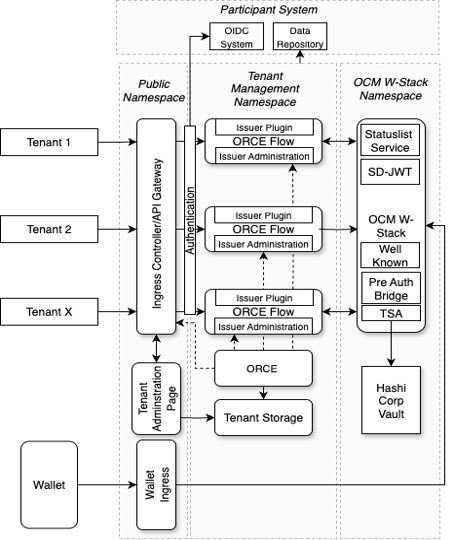

[← Conceptual Architecture](04_conceptual_architecture.md) · [↑ Table of Contents](../README.md) · [Functional Requirements →](06_functional_requirements.md)

---

## 5. Technical Architecture

The solution shall be deployed on a Kubernetes-based microservices architecture. The system shall consist of independently deployable services communicating through well-defined interfaces. The Kubernetes cluster shall be logically organized into separate namespaces to ensure isolation of responsibilities and security boundaries. At minimum, the following namespaces for the cluster shall be defined:

- A public namespace,
- A tenant management namespace for tenant-specific services and configurations,
- An OCM W-Stack namespace for credential issuance infrastructure components.

Namespace separation shall ensure logical isolation, controlled access policies, and clear operational responsibility boundaries. Architectural deviations from this structure shall only be permitted where technically justified and shall not compromise security, multi-tenancy isolation, or operational stability.

<em>Figure 3 Technical Overview</em>

---

[← Conceptual Architecture](04_conceptual_architecture.md) · [↑ Table of Contents](../README.md) · [Functional Requirements →](06_functional_requirements.md)

