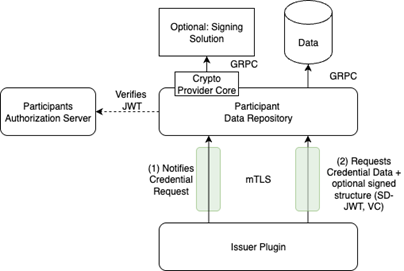

[← Deployment & Operations](09_deployment_operations.md) · [↑ Table of Contents](../README.md) · [Validation & Acceptance Criteria →](11_validation_acceptance_criteria.md)

---

## 10. Standards & Protocols

### 10.1 UX Framework

#### [FR-PCI-59] Low Code   
**Priority:** MUST    
**Description:** The UX framework MUST be a low-code variant where a pre-defined page can be easily adopted by the participant tenant administrator. This can be a CMS, ORCE, or something else. The entire UX framework MUST be consistent across the entire solution. This SHALL enable the participant tenant to customize the white label UX.   
**Acceptance criteria:**   
Demonstration of modification without coding with the same UX framework in all UIs.

#### [FR-PCI-60] Layout Customization    
**Priority:** MUST   
**Description:** The UX framework MUST allow modifications to logos, colors, and the entire page design according to FACIS style sheets and other configurations.   
**Acceptance criteria:**
- Demonstration of website modification to FACIS layout,
- Live demonstration of website style ad-hoc during the presentation.

#### [FR-PCI-61] UX Tests    
**Priority:** MUST   
**Description:** The UX steps MUST be tested E2E via BDD tests by using the [BDD Executor](https://github.com/eclipse-xfsc/bdd-executor) similar to the [Cloud PCM tests](https://github.com/eclipse-xfsc/cloud-wallet-integration-tests/blob/main/steps/presentation_selection_steps.py).  
**Acceptance criteria:**  
Demonstration of the automated tests.

#### [FR-PCI-62] OID4VCI/VP Version   
**Priority:** MUST   
**Description:** OID4VCI/VP Version Draft 13 and 1.0 MUST be supported.   
**Acceptance criteria:**
- Code review,
- UX can represent both versions.

### 10.2 Participant Data Protocol

#### [FR-PCI-63] Protocol Structure   
**Priority:** MUST  
**Description:** The protocol to communicate with the participant’s system/data source for the issuance is based on two requests: credential data request and credential request notification. The protocol MUST communicate via REST or GRPC. During the credential data request, there MUST be an option to get either just the data of a credential configuration (unsigned VC and SD-JWT) or the entire signed credential. The credential signing within the data repository service MUST be implemented via the Crypto Provider Core GRPC interface to support various providers. If there are any additional requests required, they MAY be introduced.

<em>Figure 4 Credential Data Protocol</em>

**Acceptance criteria:**
- Demonstrate the protocol functionality via example setups,
 - Demonstrate a setup with credential signing,
- Demonstrate a setup without credential signing but with signing within OCM.

### 10.3 GitHub Requirements

#### [FR-PCI-64] Standard Workflows   
**Priority: MUST**
**Description:** All GitHub repositories which contain code MUST contain standard workflows from the [GitHub DevOps](https://github.com/eclipse-xfsc/dev-ops/tree/main/.github/workflows) section. Especially the docker build, test, eclipse IP scan and SBOM creation. The workflows MUST be integrated as remote [workflow](https://github.com/eclipse-xfsc/email-service/blob/main/.github/workflows/sbom.yml#L11).   
**Acceptance criteria:**
 - Code review,
- Run action log.

---

[← Deployment & Operations](09_deployment_operations.md) · [↑ Table of Contents](../README.md) · [Validation & Acceptance Criteria →](11_validation_acceptance_criteria.md)

